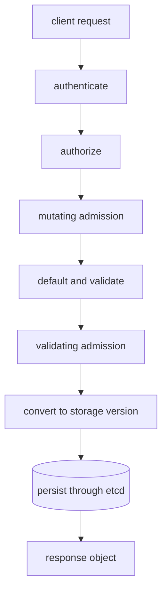

# Kubernetes API Machinery

An `apply` conflict, a rejected field, or a watch that suddenly relists are
three different failures in the same boundary: clients do not manipulate
cluster state directly. They exchange versioned resources with the API server.

> [!info] Baseline
> Reviewed against Kubernetes v1.36 documentation on 2026-07-17. Admission
> configuration, enabled API groups, feature gates, and flow-control policy are
> cluster-specific.

This page explains the API contract and the evidence visible to a client. It
does not document every admission plugin or the API server's internal Go call
graph.

## Resource Identity And Discovery

An object kind is not enough to identify an endpoint. A client discovers a
resource by API group, version, resource name, and scope:

```text
apps/v1, Kind=Deployment -> /apis/apps/v1/namespaces/{ns}/deployments
v1,      Kind=Node       -> /api/v1/nodes
```

`apiVersion` and `kind` identify the representation in a document. The REST
resource is normally plural and lowercase. Discovery also tells a client which
verbs, short names, subresources, and namespaced/cluster scope the server
currently exposes.

`kubectl get all` is not discovery and does not mean all resource types. It is
a convenience category containing only selected resources.

## One Modifying Request

The stable external ordering is authentication, authorization, and admission.
Within the request machinery, conversion, defaulting, validation, and storage
handling also occur; exact internal placement varies with the verb and type.



Reads are authenticated and authorized but do not pass through admission
control. A successful write means the resource was accepted and persisted; it
does not wait for controllers or nodes to act on it.

## Representations And Versions

The v1.36 API can negotiate JSON and YAML. Kubernetes Protobuf is more compact
for built-in types, but it does not cover CRDs or resources served by an
aggregated API server. CBOR support is alpha and feature-gated in this baseline.

The requested API version and the storage version can differ. The API server
converts between them, so an etcd value is not a supported client interface.
Conversion preserves the API contract, not necessarily byte-for-byte input.

## Revisions, LIST, And WATCH

`metadata.resourceVersion` identifies a version of API data. Treat it as an
opaque token, not an integer clock that clients may calculate with.

A common reflector sequence is:

1. LIST a consistent collection snapshot and record its resource version.
2. WATCH changes after that version.
3. Update a local cache as events arrive.
4. Relist when the watch expires, compacts, disconnects, or becomes too old.

A watch is a resumable stream, not a permanent subscription. A `410 Gone`
response means the requested history is no longer available and the client
must rebuild state from a new list. Watch bookmarks mark progress but do not
contain object state.

Two separate GETs are not an atomic multi-object snapshot. A local informer
cache can also be deliberately behind the API server.

## Updates, Patches, And Ownership

| Mechanism | Intent | Main concurrency concern |
| --- | --- | --- |
| `PUT` update | replace the submitted object representation | stale `resourceVersion` causes a conflict |
| JSON Patch | apply ordered operations to JSON paths | paths or tests may no longer match |
| JSON Merge Patch | recursively merge JSON objects | list behavior is coarse |
| Strategic Merge Patch | schema-aware merge for supported built-ins | not supported for CRDs |
| Server-Side Apply | declare fields owned by a field manager | conflicts with another manager's differing field |

Server-Side Apply records ownership in `metadata.managedFields`. A conflict is
useful: it prevents one manager from silently taking a field another manager
controls. `--force-conflicts` transfers ownership and is a mutation decision,
not a generic retry switch.

`generation` changes when desired state changes for resources that support it.
Controllers commonly report the generation they observed in status. This is a
different signal from `resourceVersion`, which changes for object revisions.

## Flow Control Is Not Client Throttling

API Priority and Fairness classifies and queues server requests so important
traffic is protected under load. Client QPS limits and exponential backoff
reduce request pressure before or after a server response. Seeing client-side
throttling does not prove APF rejected a request, and an HTTP `429` needs server
headers and metrics for attribution.

## Failure Map

| Evidence | Likely boundary | Next check |
| --- | --- | --- |
| `401 Unauthorized` | authentication | credential source, audience, expiry |
| `403 Forbidden` | authorization | exact verb, resource, subresource, namespace |
| admission denial | policy or webhook | response message, webhook health, failure policy |
| unknown field or kind | schema, version, or discovery | server version and discovered resource |
| `409 Conflict` on update | stale object revision | refetch before recomputing the change |
| apply ownership conflict | managed field differs | inspect managers and intended ownership |
| watch `410 Gone` | retained history compacted | relist and resume from the new revision |
| widespread latency or `429` | APF, API server, webhook, or storage pressure | request metrics and dependency latency |

## Read-Only Evidence

```bash
kubectl api-resources --sort-by=name
kubectl api-versions
kubectl get --raw /readyz?verbose
kubectl get deploy web -o yaml --show-managed-fields
kubectl auth can-i get pods --namespace default
```

The last command asks the authorization API about the current identity; it
does not prove that admission will accept a later write.

## What This Does Not Mean

- A newer `resourceVersion` does not mean a greater semantic generation.
- A watch delivers changes, not an exactly-once job queue.
- YAML is not the representation stored in etcd.
- Server-Side Apply does not make two managers' intentions compatible.
- API acceptance does not imply workload convergence.

See [API observation](hacks/kubernetes/api.md) for focused command pipelines
and [Reconciliation](reconciliation.md) for the consumers of these streams.

## References

- [Kubernetes API concepts](https://kubernetes.io/docs/reference/using-api/api-concepts/)
- [Server-Side Apply](https://kubernetes.io/docs/reference/using-api/server-side-apply/)
- [Authentication](https://kubernetes.io/docs/reference/access-authn-authz/authentication/)
- [Authorization](https://kubernetes.io/docs/reference/access-authn-authz/authorization/)
- [Admission controllers](https://kubernetes.io/docs/reference/access-authn-authz/admission-controllers/)
