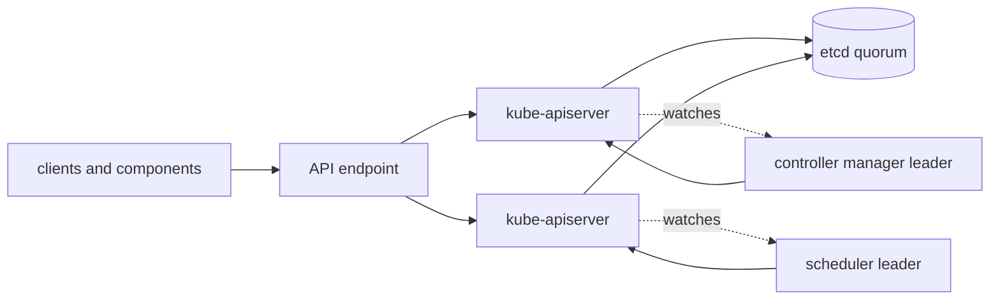

# Kubernetes Control Plane

When unrelated creates, status updates, scheduling decisions, and watches slow
down together, look for a shared control-plane dependency before debugging each
workload independently.

> [!info] Baseline
> Reviewed against Kubernetes v1.36 documentation on 2026-07-17. Managed
> services hide different parts of this evidence; self-managed static-Pod
> commands are not portable to hosted control planes.

This page explains roles and failure propagation. It is not an etcd recovery
runbook, HA sizing guide, or vendor-specific control-plane procedure.

## Components And Authority

| Component | Responsibility | Does not do |
| --- | --- | --- |
| kube-apiserver | API contract, authn/authz/admission, storage mediation, watch delivery | run Pods or make scheduling choices |
| etcd | durable, revisioned storage using Raft consensus | understand Kubernetes reconciliation semantics |
| kube-controller-manager | run core control loops | place an unbound Pod on a node |
| kube-scheduler | choose a feasible/preferred node and bind the Pod | start containers on that node |
| cloud-controller-manager | integrate supported cloud lifecycle and routing concerns | exist in every cluster |

API server replicas do not keep the authoritative cluster database in local
process memory. They do keep transient connections, caches, metrics, and flow-
control state, so replicas are not operationally invisible.



## etcd, Quorum, And Latency

etcd uses Raft to commit writes through a quorum. Losing a minority member can
preserve availability; losing quorum prevents safe progress. Slow disks or
network delay can be as damaging as a crashed member because API writes wait on
the storage path.

Kubernetes clients should not read or write etcd directly. API conversion,
validation, authorization, admission, and watch semantics live above it. See
[Consensus](net/consensus.md) for the quorum model.

## Leader Election

Schedulers and controller managers can run multiple instances while one leader
per election performs active work. Kubernetes uses Lease objects for this and
other coordination. Leader loss causes a bounded gap while another candidate
acquires the Lease; rapid repeated changes indicate control-plane, network, or
latency trouble rather than useful load balancing.

Lease records also serve other purposes, including Node heartbeats. Similar
object type does not mean the same actor or failure policy.

## Failure Propagation

| Failure | Existing workload impact | Change and observation impact |
| --- | --- | --- |
| one API server replica fails | usually none if endpoint and remaining replicas work | connections reset; watches reconnect |
| API endpoint unavailable | running processes may continue | reads, writes, status, controllers, and scheduling stall |
| etcd loses quorum | running processes may continue temporarily | durable API writes cannot safely commit |
| etcd or API storage is slow | data plane may initially continue | request latency, watch lag, queues, and leader renewals degrade |
| controller manager unavailable | existing Pods can continue | replicas, endpoints, nodes, and other loops stop converging |
| scheduler unavailable | bound Pods can continue | new unbound Pods remain `Pending` |
| admission webhook unavailable | existing objects usually continue | matching writes fail or wait according to failure policy |

"Pods keep running" is a limited statement. Kubelet behavior, probes, local
restarts, credentials, node failures, and data-plane dependencies still apply.

## Evidence Ladder

1. Check the external API endpoint and `/livez` versus `/readyz`.
2. Separate request latency by verb/resource and response code.
3. Check admission webhook and API Priority and Fairness evidence.
4. Check etcd leader, quorum, commit and disk latency through supported metrics.
5. Check leader-election churn and controller/scheduler queues.
6. Only on a self-managed cluster, inspect the discovered control-plane runtime
   and static Pod logs with its actual tooling.

`livez` answers whether the process should be restarted. `readyz` answers
whether it can currently serve traffic. Treat individual verbose checks as
diagnostic signals, not a substitute for request and dependency metrics.

## Backup Is Not Recovery

An etcd snapshot is useful only with a version-compatible, tested restoration
procedure that accounts for certificates, encryption configuration, member
identity, API server configuration, and the chosen Kubernetes recovery model.
Do not turn a production incident into the first restore rehearsal.

## Read-Only Evidence

```bash
kubectl get --raw /livez?verbose
kubectl get --raw /readyz?verbose
kubectl get --raw /metrics
kubectl get lease -A
kubectl get --raw '/apis/flowcontrol.apiserver.k8s.io/v1/prioritylevelconfigurations'
```

Metrics output is large; the operational page provides focused filters. Access
to health endpoints and metrics depends on authorization and deployment.

## What This Does Not Mean

- Multiple API servers do not create multiple authoritative cluster states.
- An etcd leader is not the Kubernetes control-plane leader.
- Loss of API access does not immediately stop every running process.
- A green `/livez` does not prove storage latency is acceptable.
- An available snapshot does not prove restore readiness.

See [Control-plane triage](hacks/kubernetes/control_plane.md) for bounded
read-only checks.

## References

- [Kubernetes components](https://kubernetes.io/docs/concepts/overview/components/)
- [Operating etcd clusters for Kubernetes](https://kubernetes.io/docs/tasks/administer-cluster/configure-upgrade-etcd/)
- [Kubernetes API health endpoints](https://kubernetes.io/docs/reference/using-api/health-checks/)
- [Leases](https://kubernetes.io/docs/concepts/architecture/leases/)
