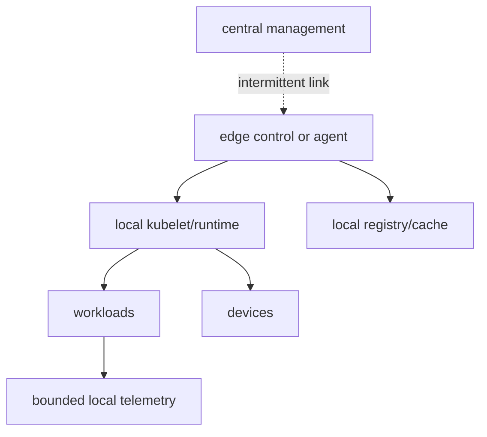
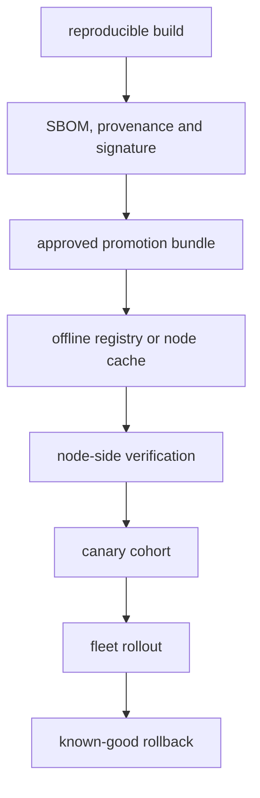

# Edge Kubernetes

Edge design starts with degraded operation. A smaller Kubernetes distribution
does not by itself solve loss of link, power, registry, clock, storage or trust.

> [!info] Baseline
> Reviewed against Kubernetes v1.36, K3s and KubeEdge documentation on
> 2026-07-17. Distribution and hardware behavior requires a pinned acceptance
> environment.

## Start With Constraints

Record these before choosing a distribution:

| Constraint | Required decision |
| --- | --- |
| cloud link | tolerated outage, bandwidth, latency, asymmetry and reconnect rate |
| compute | architectures, cores, memory, accelerators and reserved system budget |
| storage | write endurance, local durability, encryption and recovery method |
| power | abrupt-loss behavior, boot time and safe state |
| time | trusted source, holdover and certificate/log behavior under drift |
| physical access | tamper assumptions, key storage and replacement procedure |
| software delivery | offline artifacts, verification, cohorts and rollback deadline |
| mission workload | local authority, safety boundary and acceptable degraded mode |

Kubernetes remains a coordination layer. Safety-critical or real-time control
loops need an explicit boundary from control-plane and garbage-collected
workloads.

## Failure Domains

Ask who owns desired state during disconnection. Existing containers can keep
running without a reachable API server, but scheduling, secret/config updates,
controller actions and recovery can depend on components that are no longer
available.

## Distribution Models

| Model | Strength | Main trade-off |
| --- | --- | --- |
| upstream-style cluster at site | familiar semantics and full control plane | resource and operational cost |
| K3s | compact packaging and documented air-gap workflows | bundled defaults still need explicit HA/network/storage design |
| KubeEdge | cloud-edge separation and edge autonomy model | additional synchronization, device and version boundaries |
| managed fleet/agent model | centralized lifecycle tooling | vendor/control-link dependency and local authority model |

Choose from workload and failure requirements. “Lightweight” is not a recovery
objective.

## Disconnected Artifact Flow

The bundle includes every architecture-specific image, manifest, chart,
configuration schema, OS/package dependency, signature material and rollback
artifact. Digest pinning prevents tag drift but does not establish provenance
or authorization by itself.

K3s supports private registry, per-node image archives and an embedded registry
mirror for air-gap scenarios. Each option changes disk, distribution and trust
failure modes.

## Upgrade Protocol

1. Verify compatibility across OS/kernel, runtime, CNI, CSI, Kubernetes and
   device drivers.
2. Rehearse forward and rollback paths on hardware matching the field cohort.
3. Promote a signed immutable bundle through a small canary cohort.
4. Gate on workload, node, network, storage, device and telemetry health.
5. Pause automatically on error budget or reconnect storm.
6. Retain the previous known-good bundle until the rollback deadline expires.
7. Record the exact fleet state for nodes that missed a rollout window.

Rollback is a tested state transition, not “apply the old YAML.” Data/schema
changes and firmware can make rollback impossible.

## Devices And Topology

Device plugins advertise vendor resources to kubelet and service allocation
through a node-local gRPC API. Kubernetes v1.36 also advances Dynamic Resource
Allocation for richer device selection and allocation. Treat feature state and
driver support as version-sensitive.

Hardware work adds:

- driver, firmware and application compatibility;
- NUMA and CPU/device locality;
- SR-IOV, IOMMU and privilege boundaries;
- hot-unplug and unhealthy allocation behavior;
- kubelet/plugin restart and re-registration;
- replacement of a failed device or whole node.

An unhealthy device can reduce allocatable capacity while an already assigned
workload still needs application-level failure handling.

## Networking At The Edge

Edge networks can have multiple interfaces, dynamic routes, narrow MTU,
satellite/radio links, multicast discovery and disconnected DNS. Pin the node
IP selection and route ownership; test asymmetric return paths and interface
failover.

DDS and other multicast-dependent middleware need a separate compatibility
test. Pod IP churn, overlay support, multicast scope and `hostNetwork` change
the discovery domain. See [DDS](net/dds.md); do not use `hostNetwork` as an
unexamined fix.

Cilium/eBPF can reduce or move dataplane work, but kernel features, BPF map
memory, agent availability and upgrade compatibility become part of the node
baseline. Service mesh adds proxy CPU/memory and configuration dependencies;
select L4/L7 features from the link and resource budget.

## Security Boundary

For physically exposed and disconnected nodes, define:

- secure/measured boot and hardware-backed device identity where available;
- encrypted local data and key revocation behavior while offline;
- least-privilege workload identity and short-lived credentials with a usable
  offline validity model;
- signed artifacts, SBOM and admission/verification ownership;
- local audit retention and controlled export;
- recovery after theft, cloning, tamper or certificate expiry.

A certificate that expires during a planned disconnection is an availability
failure created by the security design.

## Acceptance Matrix

| Injected failure | Required proof |
| --- | --- |
| cloud link removed | defined workloads and local control continue for the target duration |
| registry unavailable | restart succeeds from approved local artifacts |
| power loss | filesystem, runtime and application recover to a known state |
| DNS/upstream time lost | local dependencies and certificate policy behave as designed |
| disk fills | telemetry/cache limits protect the workload and recovery remains possible |
| device becomes unhealthy | health is observable and workload enters the defined degraded mode |
| bad release | cohort stops and rollback meets the deadline |
| long reconnect | control and telemetry traffic remain bounded |

Run these in a disposable hardware-representative environment. A VM-only test
does not validate device, power or storage-endurance behavior.

## What This Does Not Mean

- K3s is automatically more reliable than a larger distribution.
- Edge autonomy means accepting arbitrary desired-state divergence forever.
- Cached images form a complete air-gap supply chain.
- Kubernetes provides hard real-time scheduling.
- A device plugin repairs failed hardware.
- Service mesh belongs on every constrained node.

See the [Professional Roadmap](roadmap.md),
[eBPF And Cilium](networking/ebpf_cilium.md), and
[Observability And Tracing](observability.md).

## References

- [K3s architecture](https://docs.k3s.io/architecture)
- [K3s air-gap installation](https://docs.k3s.io/installation/airgap)
- [KubeEdge architecture](https://kubeedge.io/docs/category/architecture/)
- [Kubernetes device plugins](https://kubernetes.io/docs/concepts/extend-kubernetes/compute-storage-net/device-plugins/)
- [Dynamic Resource Allocation](https://kubernetes.io/docs/concepts/scheduling-eviction/dynamic-resource-allocation/)
