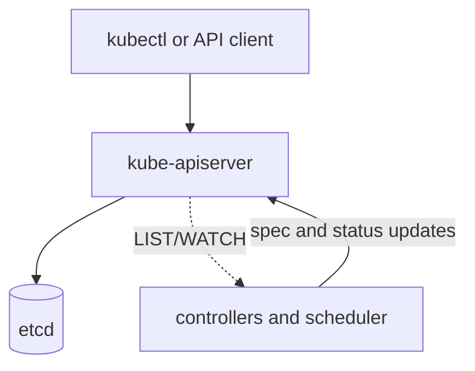
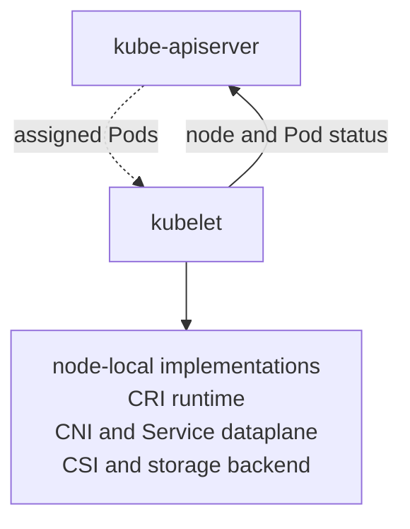

# Kubernetes Internals

Kubernetes is an API-driven system of control loops. A successful API write
records desired state; it does not mean that every controller, node, network,
or storage component has already observed and realized that state.

> [!info] Baseline
> Reviewed against Kubernetes v1.36 documentation on 2026-07-17. The pages
> distinguish documented API behavior from common implementation paths and
> version-sensitive details. Live-cluster labs require their own pinned cluster
> distribution and image digest.

## System Model

Three areas cooperate without forming one synchronous pipeline:

| Area | Main responsibility | Durable authority |
| --- | --- | --- |
| Control plane | Accept API requests, persist objects, schedule work, run controllers | API objects persisted through the API server to etcd |
| Node plane | Reconcile assigned Pods with runtime, network, volume, and process state | Node-local runtime and kernel state, reported back through the API |
| Data plane | Carry application traffic and storage I/O | Implementation-specific CNI, Service, Gateway, CSI, and backend state |

"Data plane" is an architectural boundary, not one required Kubernetes
binary. Its implementation varies by cluster.

Node realization is a separate feedback path:

Arrows back to the API server are independent updates. Status can therefore be
valid but temporarily stale, and related controllers can report different
revisions without corrupting the API model.

## From Recipe To Primitive

The Deck separates three layers:

| Operational question | Kubernetes mechanism | Lower-level primitive |
| --- | --- | --- |
| Why is `apply` conflicting? | field ownership and optimistic concurrency | HTTP PATCH, compare-and-swap style revisions |
| Why is a Pod `Pending`? | scheduler filters and binding | queues, constraints, resource accounting |
| Why is the Pod ready but absent from traffic? | EndpointSlice conditions and Service routing | namespaces, routes, packet filtering |
| Why is CPU throttled? | limits translated by kubelet/runtime | Linux cgroup v2 CPU controller |
| Why is the API slow or unavailable? | API server and etcd failure propagation | Raft quorum, storage and network latency |

Commands live under [Kubernetes hacks](hacks/kubernetes/kubernetes.md).
These pages explain why the commands expose useful evidence.

## Learning Path

Start with [Object To Running Pod](object_to_running_pod.md). It follows one
Deployment-created Pod through the synchronous API write and the independent
control loops that converge afterward.

Use the [Professional Roadmap](roadmap.md) to sequence Linux, core Kubernetes,
networking, eBPF/Cilium, service mesh, observability, and edge systems. The
[Interview Checkpoints](interview.md) identify the first mechanism that still
needs a model, lab, and evidence trace.

### API And Control Loops

- [API Machinery](api_machinery.md): discovery, request processing,
  representations, LIST/WATCH, patches, and field ownership
- [Reconciliation](reconciliation.md): informers, caches, keyed work queues,
  retries, ownership, and finalizers
- [Control Plane](control_plane.md): API server, controller manager, scheduler,
  etcd, leader election, and failure propagation

### Placement And Execution

- [Scheduling](scheduling.md): queue, Filter and Score plugins, binding,
  preemption, and retries
- [Pod Lifecycle](pod_lifecycle.md): kubelet Pod sync, CRI, images, probes,
  restart backoff, and termination
- [Node Lifecycle](node_lifecycle.md): Node status, Lease heartbeats, taints,
  eviction, cordon, drain, and shutdown
- [Resources](resources.md): requests, limits, QoS, cgroup v2, OOM, and
  node-pressure eviction

### Data Plane

- [Networking](networking.md): Pod networks, CNI, Services, EndpointSlices,
  DNS, NetworkPolicy, and Gateway/Ingress boundaries
- [Storage](storage.md): PVC/PV binding, CSI controller/node transitions,
  topology, filesystems, snapshots, and backend boundaries

### Advanced Systems

- [Service Mesh](service_mesh.md): Envoy listeners, filters, clusters, xDS,
  sidecars, Istio ambient mode, and proxy failure boundaries
- [Observability And Tracing](observability.md): context propagation, spans,
  sampling, collectors, and evidence correlation
- [Edge Kubernetes](edge.md): disconnected operation, air-gap delivery,
  constrained nodes, devices, upgrades, and local autonomy

## Route By Symptom

| Symptom | Start here | First evidence |
| --- | --- | --- |
| `apply` conflict or rejected field | [API Machinery](api_machinery.md) | server response, `managedFields`, schema |
| status does not follow spec | [Reconciliation](reconciliation.md) | generation, conditions, owner, controller logs |
| Pod remains `Pending` | [Scheduling](scheduling.md) | scheduling Events and requested resources |
| `ImagePullBackOff` or restart loop | [Pod Lifecycle](pod_lifecycle.md) | container status, current/previous logs, Events |
| Node is `NotReady` or `Unknown` | [Node Lifecycle](node_lifecycle.md) | Node condition, Lease, taints, kubelet evidence |
| throttling, OOM, or pressure eviction | [Resources](resources.md) | cgroup counters, container state, Node conditions |
| Service has no usable backend | [Networking](networking.md) | selector, EndpointSlice conditions, Pod readiness |
| PVC is `Pending` or mount fails | [Storage](storage.md) | PVC/PV, VolumeAttachment where applicable, Events |
| API timeouts or leader churn | [Control Plane](control_plane.md) | health endpoints, request metrics, etcd state |

An Event is supporting evidence. It is not durable state and not necessarily
the root cause.

## Existing Foundations

- [Containers](ct/ct.md): namespaces, cgroups, rootfs, and OCI runtimes
- [Consensus](net/consensus.md): Raft, quorum, and etcd failure reasoning
- [DNS](net/dns.md) and [TLS](net/tls.md): network and trust foundations
- [Load Average](unix/load_average.md): CPU and I/O pressure
- [Simulated Annealing](unix/math/simulated_annealing.md): an optimization
  model that is not kube-scheduler internals

## References

- [Kubernetes components](https://kubernetes.io/docs/concepts/overview/components/)
- [Kubernetes API concepts](https://kubernetes.io/docs/reference/using-api/api-concepts/)
- [Controllers](https://kubernetes.io/docs/concepts/architecture/controller/)
