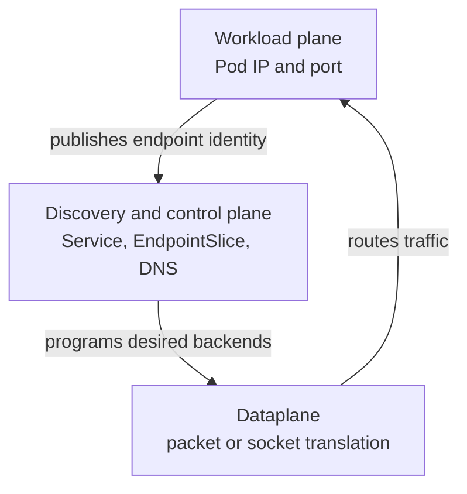

# Kubernetes Networking

A Pod can be `Ready=True` yet absent from Service traffic, or reachable by Pod
IP while its Service name fails. Those symptoms cross different layers; start
with the Kubernetes object graph before inspecting node packet rules.

> [!info] Baseline
> Reviewed against Kubernetes v1.36 documentation on 2026-07-17. The cluster's
> CNI, Service dataplane, DNS, NetworkPolicy engine, cloud integration, IP
> families, and Gateway/Ingress controllers determine the concrete packet path.

This page describes portable Kubernetes contracts. It does not assume
`iptables`, IPVS, eBPF, one overlay, or one cloud load balancer.

## Deep Path

Read these pages in dependency order:

1. [Packet Path](networking/packet_path.md): network namespaces, veth, routes,
   overlays, MTU, conntrack and packet evidence.
2. [CNI](networking/cni.md): runtime-to-plugin execution, IPAM, chaining,
   rollback and sandbox failures.
3. [Service Dataplane](networking/service_dataplane.md): Service and
   EndpointSlice state translated through iptables, nftables, IPVS or eBPF.
4. [NetworkPolicy](networking/network_policy.md): isolation, additive rules,
   enforcement ownership and a reproducible policy matrix.
5. [Kubernetes DNS](networking/dns.md): resolver behavior, CoreDNS discovery,
   Service routing, upstream forwarding and policy.
6. [eBPF And Cilium](networking/ebpf_cilium.md): kernel hooks, maps, identity,
   Hubble and kube-proxy replacement.

The [Professional Roadmap](roadmap.md) places this path between Linux
foundations and service mesh.

## Three Planes Of Evidence



1. **Workload plane:** the process listens on the expected address/port and the
   Pod network works.
2. **Discovery/control plane:** Service selectors produce EndpointSlices with
   the expected addresses, ports, and conditions.
3. **Dataplane:** the implementation on the request path translates or routes
   Service traffic to an eligible endpoint.

Debugging the dataplane before proving the endpoint set usually adds noise.

## Pod Network And CNI

Each ordinary Pod receives network identity in a shared Pod network model.
Kubelet/runtime invokes CNI configuration around Pod sandbox creation; the
plugin may create interfaces, routes, tunnels, policy state, IPAM records, or
other implementation-specific resources.

Containers in one Pod share its network namespace and can communicate over
localhost. `hostNetwork` bypasses the ordinary Pod network namespace and changes
DNS and port-collision assumptions.

Kubernetes does not require Pods to use NAT when talking to other Pods in the
abstract model. The actual underlay/overlay and egress behavior remain CNI and
environment concerns.

## Service To EndpointSlice

A selector-backed Service does not proxy traffic itself and does not own Pods.
Controllers translate its selector into EndpointSlices. Consumers use slices
as the scalable backend source.

Endpoint conditions distinguish:

- `ready`: suitable for new traffic according to readiness semantics;
- `serving`: endpoint is still serving, useful during termination;
- `terminating`: the backing endpoint is terminating.

Not every traffic implementation consumes those conditions identically, and
propagation is asynchronous. A readiness change, EndpointSlice update, and
dataplane update are separate observations.

Service ports have distinct roles: `port` is the Service-facing port;
`targetPort` selects the backend port; `nodePort` exists only for applicable
Service types. Named ports are resolved against endpoint Pod ports.

## DNS Is Discovery, Not Routing

Cluster DNS commonly synthesizes names for Services and Pods from API data.
Resolution success proves a record exists, not that any backend is ready.
Resolution failure can originate in Pod resolver configuration, DNS Service
discovery, DNS Pods, upstream forwarding, NetworkPolicy, or node networking.

Search domains and `ndots` can turn a short lookup into several queries. Capture
the exact queried name and response code before treating all DNS latency as the
same failure.

## NetworkPolicy

NetworkPolicy selects Pods and declares allowed ingress/egress relationships.
Enforcement requires a network implementation that supports it. Policy is
additive: matching allow rules combine; rule order is not a firewall program.

Ingress isolation and egress isolation are independent. A policy allowing
egress from a source does not override an ingress-isolated destination. DNS and
external return traffic also need implementation-aware reasoning.

## North-South Boundaries

`LoadBalancer`, Ingress, and Gateway API resources are control-plane requests to
controllers. They do not mandate the same dataplane:

- a `LoadBalancer` Service asks an integration to provision/expose a Service;
- Ingress is an older HTTP routing API implemented by an Ingress controller;
- Gateway API separates infrastructure, listeners, and routes with explicit
  attachment and status conditions.

Always trace resource status to the discovered controller and external object.

## Failure Map

| Evidence | Likely layer | Next check |
| --- | --- | --- |
| process fails on localhost | application | listener, port, protocol |
| Pod IP fails from peer | Pod network/policy | route, policy, CNI health on both nodes |
| Service selector has no matching Pods | discovery objects | exact labels and namespace |
| matching Pods, empty EndpointSlice | controller/status path | Service selector, controller health |
| endpoint exists but `ready=false` | readiness/termination | Pod conditions and readiness gate |
| ClusterIP fails, Pod IP works | Service dataplane | active implementation and node path |
| name fails, ClusterIP works | DNS | resolver, DNS Service endpoints, DNS logs |
| external address pending | integration/controller | resource status, class, controller Events |

## Read-Only Evidence

```bash
kubectl get service web -o yaml
kubectl get pods -l app=web --show-labels -o wide
kubectl get endpointslice -l kubernetes.io/service-name=web -o yaml
kubectl get networkpolicy -n NAMESPACE -o yaml
kubectl get gateway,httproute,ingress -A
```

Only after this trace should node-level inspection choose implementation-
specific tools. Discover the relevant CNI, proxy/dataplane, and controller
rather than assuming their names.

## What This Does Not Mean

- Pod readiness does not guarantee inclusion in every dataplane immediately.
- A Service object is not a running load-balancer process.
- DNS success does not prove the Service has endpoints.
- NetworkPolicy objects do nothing without a supporting implementation.
- Kubernetes networking does not imply `iptables`.

Use [networking triage](hacks/kubernetes/networking.md) for the ordered
object-to-packet evidence ladder.

## References

- [Cluster networking](https://kubernetes.io/docs/concepts/cluster-administration/networking/)
- [Services](https://kubernetes.io/docs/concepts/services-networking/service/)
- [EndpointSlices](https://kubernetes.io/docs/concepts/services-networking/endpoint-slices/)
- [Network policies](https://kubernetes.io/docs/concepts/services-networking/network-policies/)
- [DNS for Services and Pods](https://kubernetes.io/docs/concepts/services-networking/dns-pod-service/)
