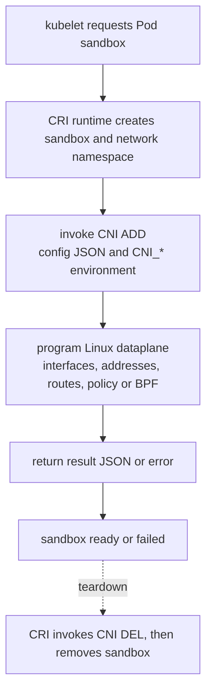

# Container Network Interface

CNI is an executable protocol used around sandbox networking. It is not the
long-running component that necessarily carries every application packet.

> [!info] Baseline
> Reviewed against CNI specification 1.1.0 and Kubernetes v1.36 documentation
> on 2026-07-17.

## Execution Contract

The runtime creates or identifies a container network namespace, selects a CNI
configuration, and invokes plugin executables. Configuration arrives as JSON
on stdin; invocation data arrives through `CNI_*` environment variables; the
plugin returns a structured result on stdout.



Core commands are `ADD`, `DEL`, `CHECK`, `VERSION`, `GC` and `STATUS`.
Support depends on the negotiated spec and plugin. `DEL` must be designed for
partial state and repeated cleanup because setup can fail halfway through.

Important invocation inputs include:

- `CNI_COMMAND`: operation;
- `CNI_CONTAINERID`: runtime sandbox identity;
- `CNI_NETNS`: network namespace path when applicable;
- `CNI_IFNAME`: interface name requested inside the namespace;
- `CNI_ARGS`: runtime arguments;
- `CNI_PATH`: executable search path.

## Plugin Chaining

A network configuration list can make the runtime invoke multiple main plugins
in sequence. Each later plugin receives the previous result, and teardown runs
in reverse order. Chaining can add policy, tuning or port mappings after base
connectivity. Result versions and interfaces must remain compatible across the
chain.

## Delegated IPAM

A main network plugin can invoke the IPAM plugin named in its own configuration
to allocate or release addresses. This delegation happens inside that plugin's
operation; it is distinct from the runtime executing successive main plugins
from a configuration list.

IPAM owns address allocation state. An interface with the expected name but no
valid address, route, or released allocation is not a successful CNI outcome.
Leaked IPAM state can exhaust a pool after Pods are gone.

## Kubernetes Boundary

Kubernetes defines the Pod networking expectations and asks the runtime to
create a sandbox. It does not standardize every node interface, tunnel, route,
policy store or BPF hook.

Common evidence chain:

```text
Pod status and Events
  -> kubelet sandbox error
  -> CRI runtime operation
  -> selected CNI configuration and binary
  -> plugin log/agent state
  -> network namespace and node state
  -> IPAM allocation
```

Use runtime tooling appropriate to the node. Do not infer the selected config
from a Helm release name alone.

## Failure Map

| Symptom | Failed boundary | Evidence |
| --- | --- | --- |
| `FailedCreatePodSandBox` | runtime or CNI `ADD` | Pod Event, kubelet/runtime logs, plugin error |
| sandbox exists without usable route | partial plugin chain | CNI result, namespace links/routes, chain order |
| new Pods cannot obtain IPs | IPAM pool or leaked allocations | IPAM state, current Pod IPs, subnet capacity |
| deletion leaves interface/address | `DEL` or node crash cleanup | runtime sandbox list, links, IPAM and plugin GC |
| only one node fails | node-local config, binary, kernel or agent | config digest and component state per node |
| upgrade splits connectivity | incompatible config/dataplane revisions | rollout state, node versions, old/new flow matrix |

## Local Implementation Audit

The [k8s-controller learning repository](https://github.com/searge/k8s-controller)
contains a useful bridge-CNI provisioning exercise. Its
`ansible/templates/10-bridge.conf.j2` demonstrates a bridge plus host-local
IPAM configuration.

Treat it as a bounded single-node lab:

- it does not provide multi-node Pod routing;
- it does not provide a NetworkPolicy engine;
- it does not install kube-proxy or cluster DNS;
- its development control-plane settings are intentionally insecure and are
  not a production bootstrap baseline.

The next useful exercise is not adding more Ansible. Trace the generated config
through one real CNI `ADD` result, namespace state and cleanup, then document
the missing cross-node, Service, DNS and policy layers.

## What This Does Not Mean

- CNI is a Kubernetes API served by the API server.
- One CNI executable remains in the packet path.
- Installing a CNI guarantees NetworkPolicy support.
- A successful `ADD` proves cross-node routing, DNS or Services.
- Deleting a Pod guarantees every allocation was reclaimed after node failure.

See [Packet Path](packet_path.md) for the Linux state CNI creates and
[NetworkPolicy](network_policy.md) for enforcement ownership.

## References

- [CNI specification](https://www.cni.dev/docs/spec/)
- [Kubernetes network plugins](https://kubernetes.io/docs/concepts/extend-kubernetes/compute-storage-net/network-plugins/)
- [Kubernetes CRI](https://kubernetes.io/docs/concepts/containers/cri/)
