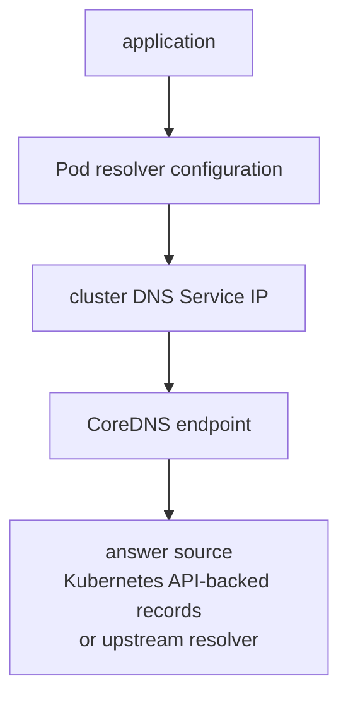

# Kubernetes DNS Internals

A Service name can fail before any application packet reaches its destination.
Trace the exact query through the Pod resolver, DNS dataplane, CoreDNS and any
upstream dependency.

> [!info] Baseline
> Reviewed against Kubernetes v1.36 DNS documentation on 2026-07-17. CoreDNS,
> NodeLocal DNSCache, stub domains and upstream resolvers are deployment choices.

## Query Path



This crosses distinct mechanisms:

1. the application and libc/runtime form one or more queries;
2. `/etc/resolv.conf` selects nameserver, search domains and options;
3. the Service dataplane maps the cluster DNS IP to a DNS endpoint;
4. CoreDNS plugins answer cluster names or forward other names;
5. NetworkPolicy and the node network must allow the request and response.

NodeLocal DNSCache, when installed, inserts a node-local listener/cache and
changes the first network hop. Discover it before assuming every query reaches
the CoreDNS Service ClusterIP directly.

## Search And `ndots`

A name with fewer dots than the configured `ndots` value is tried with search
suffixes before or alongside the absolute form, depending on resolver behavior.
One application lookup can therefore create several DNS queries and upstream
timeouts.

Record:

```bash
kubectl -n "$NAMESPACE" exec "$POD" -- cat /etc/resolv.conf
kubectl -n "$NAMESPACE" exec "$POD" -- getent hosts \
  "$SERVICE.$NAMESPACE.svc.cluster.local"
```

Use a trailing dot when deliberately testing the absolute DNS name with a tool
that honors it. Do not optimize `ndots` until the exact application query and
resolver library are known.

## Kubernetes Records

CoreDNS commonly watches Services, EndpointSlices, Pods and namespaces through
the Kubernetes API. The Kubernetes plugin synthesizes records from observed API
state; it does not probe application listeners.

| Name type | Important boundary |
| --- | --- |
| ClusterIP Service | name resolves to the Service virtual IP |
| headless Service | name resolves to selected endpoint addresses |
| ExternalName Service | name returns a CNAME to the configured external name |
| Pod hostname/subdomain | record depends on Pod and governing Service rules |

DNS success for a ClusterIP Service proves neither EndpointSlice readiness nor
Service dataplane convergence.

## Evidence Ladder

```bash
kubectl -n "$NAMESPACE" get service "$SERVICE" -o yaml
kubectl -n kube-system get service,pod -l k8s-app=kube-dns -o wide
kubectl -n kube-system get endpointslice \
  -l kubernetes.io/service-name=kube-dns -o wide
kubectl -n kube-system get configmap coredns -o yaml
kubectl -n kube-system logs deployment/coredns \
  --all-pods --since=10m --timestamps
```

Labels, workload names and namespace vary. Discover the actual DNS deployment
before using the example commands. A ConfigMap is desired configuration; prove
which Pods loaded it and whether reload succeeded.

Capture the exact queried name, record type, response code, server address and
latency. `NXDOMAIN`, `SERVFAIL`, timeout and a valid empty answer are different
failure classes.

## NetworkPolicy Boundary

An egress-isolated Pod needs access to the actual DNS path, often UDP and TCP
port 53. TCP matters for large responses, truncation and some resolver behavior.
If NodeLocal DNSCache is active, the destination seen by policy can differ from
the CoreDNS Service or Pod address.

CoreDNS also needs API access and upstream DNS access where configured. A
default-deny policy around DNS can therefore break cluster discovery, external
forwarding, or both.

## Edge And Disconnected DNS

Cluster-local records can remain answerable while upstream forwarding is
unavailable, provided the local DNS and API/state dependencies remain. Define
which external zones must resolve offline, their local authority, TTL policy,
cache behavior and recovery after long clock or link outages.

Avoid treating a long cache TTL as authoritative offline service discovery.
Cached addresses can outlive endpoints and certificates.

## Failure Map

| Symptom | Boundary | Evidence |
| --- | --- | --- |
| Service FQDN returns `NXDOMAIN` | API record or queried namespace/name | exact query, Service object and CoreDNS API sync |
| cluster names work, public names fail | forwarding/upstream path | Corefile, upstream response and CoreDNS egress |
| DNS Service IP times out | Service dataplane or policy | DNS endpoints, node dataplane and flow verdict |
| first lookup is slow | search expansion, upstream timeout or cold cache | query sequence and per-query latency |
| UDP fails, TCP works | MTU, fragmentation or UDP policy | truncated response, packet path and policy |
| only one node fails | NodeLocal cache or node dataplane | Pod resolver and DNS listener/path per node |
| records lag rollout | API watch/cache or TTL | object revision, CoreDNS state and client cache |

## What This Does Not Mean

- CoreDNS is the only Kubernetes DNS implementation.
- A successful lookup proves a ready backend.
- `/etc/resolv.conf` proves which server answered a cached application lookup.
- UDP 53 alone is sufficient for every DNS path.
- Cluster DNS can answer external names offline without configured authority or
  cached data.

See [DNS foundations](net/dns.md), [Service Dataplane](service_dataplane.md),
and [NetworkPolicy](network_policy.md).

## References

- [DNS for Services and Pods](https://kubernetes.io/docs/concepts/services-networking/dns-pod-service/)
- [Debugging DNS resolution](https://kubernetes.io/docs/tasks/administer-cluster/dns-debugging-resolution/)
- [Using CoreDNS for service discovery](https://kubernetes.io/docs/tasks/administer-cluster/coredns/)
- [NodeLocal DNSCache](https://kubernetes.io/docs/tasks/administer-cluster/nodelocaldns/)
