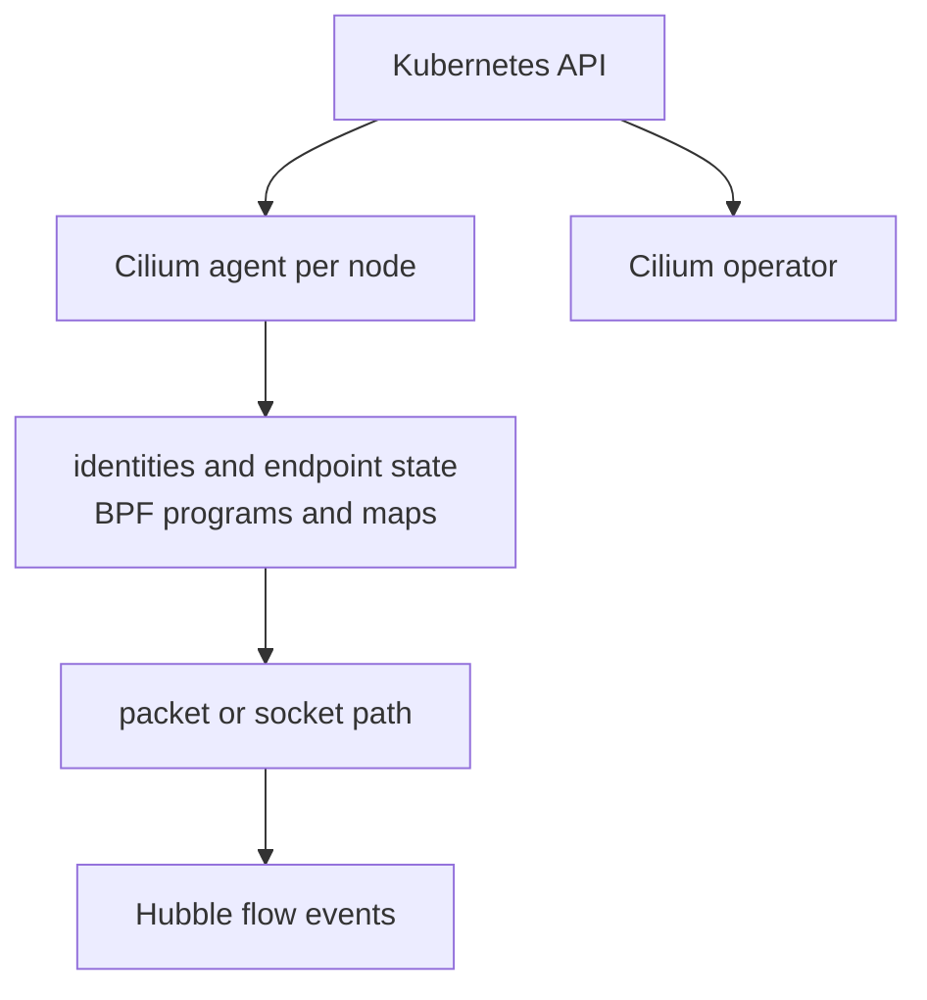

# eBPF And Cilium

Cilium is a userspace control system plus an eBPF dataplane. “eBPF” names the
kernel execution technology, not one fixed packet path.

> [!info] Baseline
> Reviewed against Linux kernel BPF documentation and Cilium 1.19.6
> documentation on 2026-07-17. Map layouts, commands and feature support are
> product-version and kernel dependent.

## eBPF Building Blocks

An eBPF program is loaded into the kernel, checked by the verifier and attached
to a supported hook. The hook determines when it runs and which context it can
inspect or modify.

| Primitive | Role |
| --- | --- |
| program | bounded logic executed at a kernel hook |
| verifier | rejects unsafe or invalid program paths before attachment |
| helper/kfunc | approved interaction with kernel functionality |
| map | persistent key/value state shared with programs or userspace |
| pin | exposes BPF objects through bpffs beyond one process descriptor |
| tail call | transfers between compatible BPF programs through a map |

Networking hooks include XDP near driver receive, tc ingress/egress, cgroup
socket and address hooks, and socket lookup. They see different data and have
different trade-offs. “Earlier” is not automatically “better.”

## Cilium Control And Data Plane



The agent observes Kubernetes and node state, allocates or learns security
identities, compiles policy and manages BPF objects. The operator handles
cluster-wide coordination tasks. Hubble exposes Cilium flow observations; it
does not replace packet capture or application tracing.

## Identity-Based Policy

Cilium maps selected endpoint labels to numeric security identities and uses
identity in dataplane policy decisions. This avoids expanding every label
selector directly into address-only rules, but introduces identity allocation,
distribution and revision as state to debug.

Trace:

```text
Kubernetes labels
  -> Cilium endpoint
  -> security identity
  -> policy revision and map state
  -> hook verdict
  -> Hubble event and packet/application outcome
```

## Routing Modes

Cilium can use encapsulation or native routing. The correct choice depends on
underlay reachability, route ownership, MTU, cloud constraints, encryption and
operational control. BGP can distribute reachability; it is not required by
the Kubernetes Pod network contract.

## kube-proxy Replacement

With kube-proxy replacement, Cilium observes Services and EndpointSlices and
programs eBPF load-balancing state for ClusterIP, NodePort, LoadBalancer and
other supported paths. Socket-level load balancing can translate a connection
before a conventional packet capture point sees the Service address.

Migration requires an explicit plan. kube-proxy and Cilium maintain independent
NAT and connection state; switching ownership can break established flows. The
kernel/cgroup requirements and rollback ordering must be verified before
removing the old dataplane.

## Evidence Ladder

Use the version-matched Cilium CLI and commands documented for the deployment:

```bash
cilium status --wait=false
cilium connectivity test --help
kubectl -n kube-system get pods -l k8s-app=cilium -o wide
```

Then inspect, with approved privileges:

```text
endpoint identity and policy revision
  -> service/backend map entry
  -> Hubble flow and verdict
  -> BPF program/map attachment
  -> narrow packet capture where the hook permits it
```

Do not paste generic `cilium-dbg bpf ...` commands into an incident before
matching the deployed Cilium version and namespace/container layout.

## Failure Map

| Symptom | Boundary | Evidence |
| --- | --- | --- |
| endpoint not ready | agent, identity or datapath regeneration | endpoint state and agent logs |
| unexpected policy deny | labels, identity or policy revision | endpoint identity, policy trace, Hubble verdict |
| Service only fails from Pods | socket LB or service map | Service/backend map and hook-specific flow |
| cross-node loss | routing/tunnel, MTU or encryption | node routes, tunnel state and captures |
| one node has stale behavior | agent/API watch or map update | agent health, map revisions and Kubernetes objects |
| flows break during migration | NAT/conntrack ownership | old/new dataplane state and new versus established flows |

## What This Does Not Mean

- eBPF bypasses all Linux networking or security controls.
- Every Cilium packet crosses XDP.
- Hubble sees application correctness or every dropped packet.
- kube-proxy replacement is enabled because Cilium is installed.
- identity policy removes the need to understand IPs, routes and MTU.

Return to [Service Dataplane](service_dataplane.md) for the portable contract
and [Packet Path](packet_path.md) for host evidence.

## References

- [Linux BPF documentation](https://www.kernel.org/doc/html/latest/bpf/)
- [Linux eBPF verifier](https://www.kernel.org/doc/html/latest/bpf/verifier.html)
- [Cilium BPF architecture](https://docs.cilium.io/en/stable/reference-guides/bpf/architecture/)
- [Cilium eBPF datapath](https://docs.cilium.io/en/stable/network/ebpf/)
- [Cilium without kube-proxy](https://docs.cilium.io/en/stable/network/kubernetes/kubeproxy-free/)
- [Hubble](https://docs.cilium.io/en/stable/observability/hubble/)
