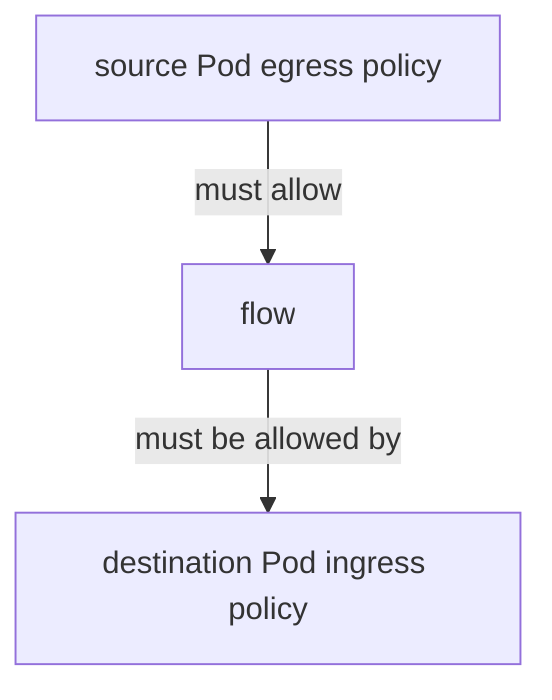

# Kubernetes NetworkPolicy Internals

A NetworkPolicy object expresses allowed communication for selected Pods. The
installed network implementation decides where and how that intent is enforced.

> [!info] Baseline
> Reviewed against Kubernetes v1.36 NetworkPolicy documentation on 2026-07-17.

## Isolation Model

Ingress and egress isolation are independent. A Pod becomes isolated for a
direction when at least one policy selects it for that direction. Applicable
allow rules are additive; policy order does not create first-match firewall
semantics.

For a connection from an egress-isolated source to an ingress-isolated
destination, both sides must allow the relevant direction.

Rules select peers using Pod selectors, namespace selectors, their conjunction,
or IP blocks. YAML indentation changes whether selectors are combined in one
peer or become separate peers.

## Identity And Timing

Label-based policy depends on observed Kubernetes identity. Pod creation,
label changes, endpoint setup and policy programming are asynchronous. A
policy engine must also decide how to treat host traffic, node-local traffic,
reply traffic, established connections and unsupported protocol details.

The Kubernetes API does not define a universal hook or packet-rule layout.
CNI documentation and conformance results establish actual support.

## DNS And External Traffic

Default-deny egress commonly breaks DNS because the application first needs to
reach the cluster DNS Service and its backing dataplane. Allow the intended DNS
destination and protocol based on the cluster implementation; do not hard-code
a remembered IP without inspecting it.

`ipBlock` expresses CIDRs, but address translation can occur before or after
policy enforcement. The observed source/destination address is implementation
and path dependent for Service and external traffic.

## Reproducible Matrix

Use three namespaces and explicit identities in a disposable cluster:

| Source | Destination | Port | Expected before | Expected after |
| --- | --- | --- | --- | --- |
| allowed client | API | application port | allow | allow |
| denied client | API | application port | allow | deny |
| API | DNS | UDP/TCP 53 | allow | allow |
| API | external test endpoint | HTTPS | allow | explicit decision |

Record the CNI/version, policy objects, Pod UIDs/IPs, test timestamp and flow
verdict. Test both directions and both same-node and cross-node placement.
Delete and recreate client connections; established-flow behavior can hide a
policy transition.

## Failure Map

| Symptom | Boundary | Evidence |
| --- | --- | --- |
| policy object exists but traffic unchanged | enforcement unsupported or selector misses | CNI capability, selected Pods, policy status if provided |
| all egress fails after default deny | missing DNS/control dependency | DNS destination, flow verdict and exact query |
| allow works only on one node | stale/missing node policy state | agent health, identity and rules/maps per node |
| namespace selector over-allows | label scope or YAML peer shape | namespace labels and parsed object JSON |
| old connection survives deny | stateful enforcement/conntrack | fresh versus established flow and engine behavior |
| Service CIDR rule behaves unexpectedly | NAT order | pre/post-translation capture and engine docs |

## What This Does Not Mean

- Policies are evaluated in manifest order.
- An empty policy list means default deny.
- Allowing source egress overrides destination ingress isolation.
- NetworkPolicy is an L7 authorization system.
- Installing any CNI guarantees complete NetworkPolicy semantics.

The practical command ladder lives in
[Kubernetes Networking Triage](hacks/kubernetes/networking.md). Cilium-specific
identity and verdict evidence lives in [eBPF And Cilium](ebpf_cilium.md).

## References

- [NetworkPolicy](https://kubernetes.io/docs/concepts/services-networking/network-policies/)
- [NetworkPolicy API](https://kubernetes.io/docs/reference/kubernetes-api/policy-resources/network-policy-v1/)
- [NetworkPolicy editor guidance](https://network-policy-api.sigs.k8s.io/)
