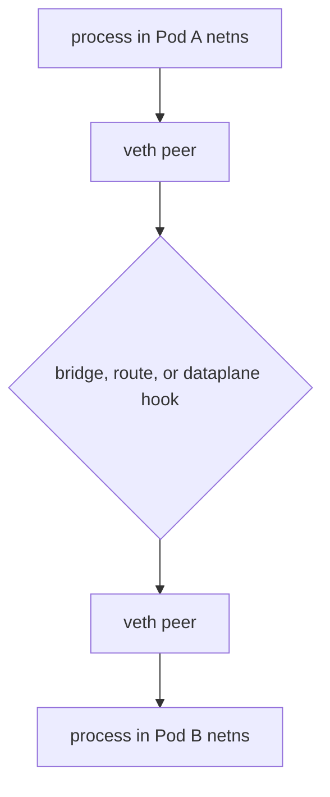
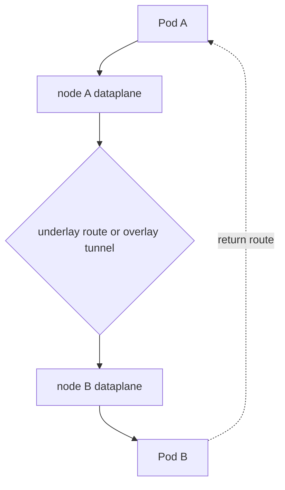

# Kubernetes Packet Path

When Pod IP traffic fails, Kubernetes objects show intent; Linux and the active
dataplane show where the packet actually went.

> [!info] Scope
> This is a portable packet model. Interface names, bridges, tunnels, routes,
> hooks and NAT depend on the installed CNI and Service dataplane.

## Packet Questions

For any flow record this tuple before inspecting rules:

```text
source namespace/IP/port
  -> destination name or IP/port
  -> protocol
  -> ingress interface and node
  -> expected endpoint and return path
```

Without the return path, a forward-path capture is incomplete evidence.

## Same Pod And Same Node

Containers in one Pod share a network namespace. `localhost` never crosses a
veth pair. Ordinary Pods on one node commonly cross a virtual Ethernet pair
and a bridge, route, or CNI-managed kernel hook.



This diagram is a set of possible boundaries, not a required Linux bridge.
An eBPF dataplane can redirect at tc, cgroup or socket hooks.

## Cross Node



Two broad implementations exist:

- native routing advertises or installs reachability for remote Pod prefixes;
- overlay networking encapsulates the inner Pod packet between node addresses.

Both still need correct routes, neighbor resolution, filtering, MTU and a
reverse path. Encapsulation reduces the inner MTU; an oversized packet with
blocked ICMP feedback can produce protocol-specific black holes.

## Stateful Boundaries

Conntrack records flow state used by stateful filtering and NAT. A stale entry,
table pressure, asymmetric path, or migration between independent NAT engines
can break existing connections while new ones succeed.

ARP for IPv4 and Neighbor Discovery for IPv6 resolve next-hop link-layer
identity. They do not discover Kubernetes Services.

## Evidence Ladder

On a node approved for inspection:

```bash
ip -br link
ip -br address
ip route
ip rule
ip route get "$DESTINATION_IP" from "$SOURCE_IP"
ip neigh show
ss -Htanp
```

Then enter the relevant network namespace using the runtime-supported tooling
and repeat interface, route and listener checks. Capture narrowly:

```bash
timeout 20 tcpdump -ni any \
  "host $SOURCE_IP and host $DESTINATION_IP and port $PORT"
```

> [!warning] Node privileges
> Namespace entry, packet capture, conntrack and BPF inspection can expose
> tenant traffic. Use an approved disposable node or incident procedure.

Do not start with `iptables-save`. First discover the active dataplane through
[Service Dataplane](service_dataplane.md) and
[eBPF And Cilium](ebpf_cilium.md).

## Failure Map

| Observation | Boundary | Next evidence |
| --- | --- | --- |
| no SYN leaves source netns | process, route or egress policy | listener/client error, route lookup, policy verdict |
| packet leaves Pod but not node | node route, filter, NAT or tunnel | interface captures and active dataplane state |
| packet reaches remote node only | remote route, policy or veth path | remote-node and Pod-netns captures |
| SYN reaches server, no SYN-ACK | listener, ingress policy or local return route | `ss`, policy verdict, route back to source |
| small requests work, large ones hang | MTU or PMTU discovery | link/tunnel MTU and ICMP evidence |
| new flows work, established flows fail | conntrack/NAT state | flow tables and recent dataplane migration |

## What This Does Not Mean

- Every Pod uses a Linux bridge.
- `tcpdump -i any` observes every eBPF socket-level decision.
- A successful forward route proves a valid return path.
- Pod IP reachability proves Service translation or DNS.

The local lab `scripts/k8s/netns_veth_lab.sh` exposes the namespace/veth/bridge
case and cleans it up. It intentionally does not model an overlay, CNI runtime,
policy engine or Kubernetes Service.

## References

- [Kubernetes cluster networking](https://kubernetes.io/docs/concepts/cluster-administration/networking/)
- [Linux network namespaces](https://man7.org/linux/man-pages/man7/network_namespaces.7.html)
- [Linux veth devices](https://man7.org/linux/man-pages/man4/veth.4.html)
- [Cilium life of a packet](https://docs.cilium.io/en/stable/network/ebpf/)
