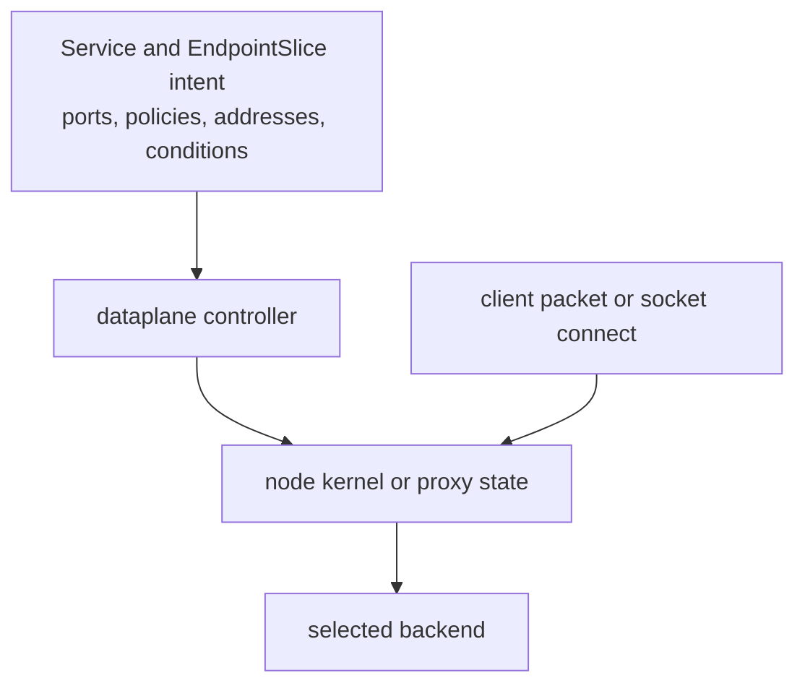

# Kubernetes Service Dataplane

A Service is API state. Traffic moves only after a dataplane consumer observes
that state and programs a usable frontend-to-backend path.

> [!info] Baseline
> Reviewed against Kubernetes v1.36 documentation on 2026-07-17. IPVS mode is
> deprecated since v1.35; nftables mode is stable but compatibility with the
> cluster network implementation must still be verified.

## State To Packet Path

`kube-proxy` watches Services and EndpointSlices, then programs node state. A
replacement such as Cilium can consume the same API intent and implement the
translation through eBPF.

## Frontend And Backend

The frontend includes Service address, port, protocol and traffic policy. The
backend includes an eligible endpoint address and resolved target port.
Endpoint readiness, termination state, topology preferences and traffic policy
affect selection independently of application health.

In the EndpointSlice API, absent `ready` and `serving` values are interpreted
as `true`; absent `terminating` is interpreted as `false`. Evidence tools should
preserve the raw value while applying those defaults to eligibility reasoning.

Service types add exposure paths; they do not replace the base mapping:

- `ClusterIP`: virtual in-cluster frontend;
- `NodePort`: node address plus allocated port;
- `LoadBalancer`: integration-specific external frontend, usually leading to
  node or Service state;
- headless Service: DNS discovery without a ClusterIP frontend.

## Implementation Families

| Mode | Main state | Useful observation | Boundary |
| --- | --- | --- | --- |
| iptables | netfilter rules and conntrack | rule counters, NAT chains, conntrack | rule count and update behavior matter at scale |
| nftables | nftables rules/maps | ruleset, counters, kube-proxy metrics | newer mode; verify CNI compatibility |
| IPVS | virtual services plus supporting rules | `ipvsadm`, netfilter state | deprecated in Kubernetes v1.35 |
| eBPF replacement | BPF programs and maps | implementation CLI, `bpftool`, flow events | hook and map layout are implementation-specific |
| userspace/proxy | proxy sockets and process state | listeners, config, logs and metrics | not the common Linux kube-proxy path |

These are implementation studies, not interchangeable commands.

## Ordered Trace

1. Read Service selector, ports, type and traffic policies.
2. Resolve matching Pods, declared ports and EndpointSlice target ports.
3. Read EndpointSlice addresses, ports and conditions.
4. Identify the active Service dataplane on the failing node.
5. Inspect its frontend/backend state and update health.
6. Trace the packet or socket decision and its reverse path.

`scripts/k8s/service_path.py` automates steps 1-3 from structured fixtures or
read-only `kubectl -o json`. It deliberately stops before claiming a kernel
path.

## Failure Map

| Symptom | Boundary | Evidence |
| --- | --- | --- |
| no endpoints | selector/controller path | Service, Pods, EndpointSlices |
| only some backends receive traffic | readiness, topology or stale dataplane | slice conditions and node frontend/backend state |
| ClusterIP fails on one node | node-local programming | dataplane health/state on good and bad nodes |
| existing connections fail after migration | independent NAT/conntrack state | old/new mode, flow age, conntrack/map entries |
| external client source IP disappears | SNAT and traffic policy | `externalTrafficPolicy`, chosen backend and captures |
| NodePort works locally only | exposure address, route or firewall | bind/exposure state and host packet path |

## What This Does Not Mean

- A Service is a process listening on the ClusterIP.
- `kube-proxy` proxies every packet in userspace.
- EndpointSlice readiness guarantees immediate convergence on every node.
- A `LoadBalancer` object guarantees external infrastructure is ready.
- Kubernetes v1.36 requires nftables or eBPF.

See [eBPF And Cilium](ebpf_cilium.md) for one replacement and
[networking triage](hacks/kubernetes/networking.md) for read-only commands.

## References

- [Virtual IPs and Service proxies](https://kubernetes.io/docs/reference/networking/virtual-ips/)
- [Services](https://kubernetes.io/docs/concepts/services-networking/service/)
- [EndpointSlices](https://kubernetes.io/docs/concepts/services-networking/endpoint-slices/)
- [Cilium kube-proxy replacement](https://docs.cilium.io/en/stable/network/kubernetes/kubeproxy-free/)
