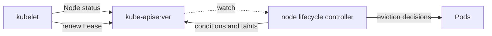

# Kubernetes Node Lifecycle

`Ready=Unknown`, a stale Lease, and `node.kubernetes.io/unreachable` are related
signals, not synonyms. They show different stages of control-plane observation
and response to a node that may still be running local workloads.

> [!info] Baseline
> Reviewed against Kubernetes v1.36 documentation on 2026-07-17. Node monitor,
> eviction, graceful shutdown, autoscaler, and cloud integration settings are
> cluster-specific.

This page covers control-plane/node coordination. It does not provide a drain
procedure for a particular storage, quorum, or stateful workload.

## Two Heartbeat Channels

Kubelet updates both:

- the Node `.status`, which contains conditions, addresses, capacity,
  allocatable resources, and node information;
- a lightweight Lease in `kube-node-lease`, renewed more frequently as a
  heartbeat.



The node lifecycle controller interprets missed heartbeats, changes Node
conditions, and manages taints used for scheduling and eviction behavior. It
cannot distinguish every network partition from a powered-off machine.

## Conditions And Taints

`Ready=False` is a reported unhealthy state; `Ready=Unknown` usually means the
control plane has stopped hearing from kubelet. Pressure conditions such as
`MemoryPressure`, `DiskPressure`, and `PIDPressure` describe specific node
signals.

Taint effects have separate meanings:

| Effect | Consequence without a matching toleration |
| --- | --- |
| `NoSchedule` | new Pods are not placed there |
| `PreferNoSchedule` | scheduler avoids the node when possible |
| `NoExecute` | new Pods are rejected and existing Pods can be evicted |

Tolerations permit scheduling or continued residence; they do not repair the
underlying node condition.

## Cordon, Drain, And Eviction

`cordon` marks a Node unschedulable for ordinary new placement. It does not move
existing Pods. `drain` is a client-orchestrated sequence that cordons and uses
the eviction API or deletion for selected Pods.

The eviction API respects applicable PodDisruptionBudgets. A PDB limits
voluntary disruption; it is not a promise that hardware, kubelet, or
node-pressure failure cannot remove a Pod. DaemonSet Pods and local data require
explicit operational decisions.

Direct Pod deletion, eviction, node-pressure eviction, taint-based eviction,
and kubelet restart policy are different mechanisms.

## Shutdown And Partitions

With graceful node shutdown configured and detected, kubelet can terminate Pods
according to configured shutdown budgets. A sudden power loss or partition has
no such local grace path. The control plane waits for heartbeat and eviction
thresholds, while the old process state may be unknown.

This uncertainty matters for single-writer storage and external systems: a
replacement Pod can be unsafe if the old node may still access the resource.

## Failure Map

| Evidence | Likely boundary | Next check |
| --- | --- | --- |
| Lease current, Node status old | status update path or kubelet pressure | kubelet and API update errors |
| Lease stale, `Ready=Unknown` | kubelet/API connectivity or node loss | node reachability and control-plane network |
| `Ready=False` with pressure | reported local resource condition | corresponding resource counters and filesystem |
| node cordoned, healthy | administrative scheduling gate | who changed `unschedulable` and why |
| drain blocked | PDB, unmanaged Pod, DaemonSet, finalizer, or API issue | drain output and owning workload |
| Pods remain on unreachable node | toleration/eviction timing or controller health | taints, toleration seconds, node controller |

## Read-Only Evidence

```bash
kubectl get nodes -o wide
kubectl describe node NODE
kubectl get lease -n kube-node-lease NODE -o yaml
kubectl get pods -A --field-selector spec.nodeName=NODE -o wide
kubectl get pdb -A
```

Lease renewal time and Node condition transition time come from different
writers and should be correlated with clocks and API latency in mind.

## What This Does Not Mean

- A toleration does not make an unhealthy node healthy.
- `cordon` does not evict existing Pods.
- `drain` is not one atomic server-side operation.
- A PDB does not prevent involuntary disruption.
- Deleting a Node object does not power off or wipe the machine.

Use [node maintenance](hacks/kubernetes/node_maintenance.md) for a guarded
read-before-mutate sequence.

## References

- [Nodes](https://kubernetes.io/docs/concepts/architecture/nodes/)
- [Leases](https://kubernetes.io/docs/concepts/architecture/leases/)
- [Taints and tolerations](https://kubernetes.io/docs/concepts/scheduling-eviction/taint-and-toleration/)
- [Safely drain a node](https://kubernetes.io/docs/tasks/administer-cluster/safely-drain-node/)
