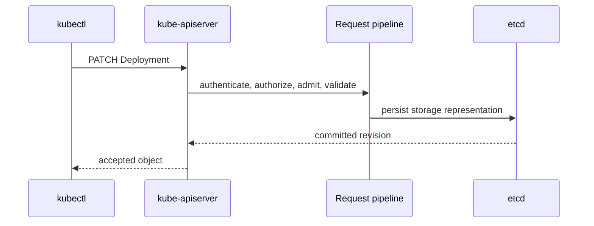
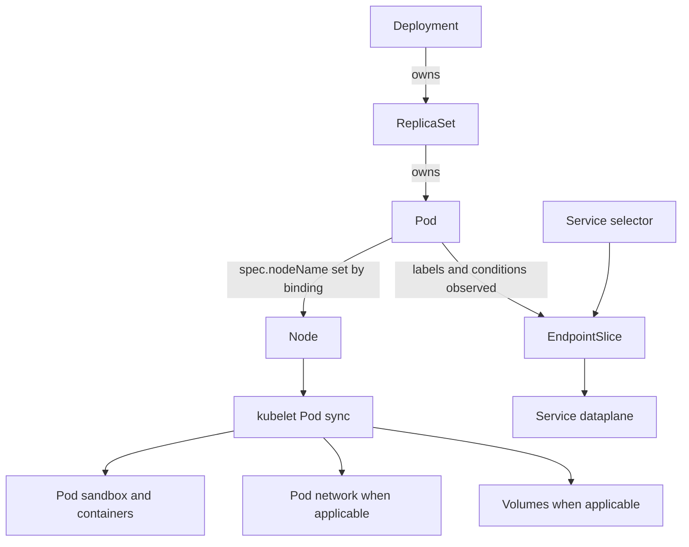
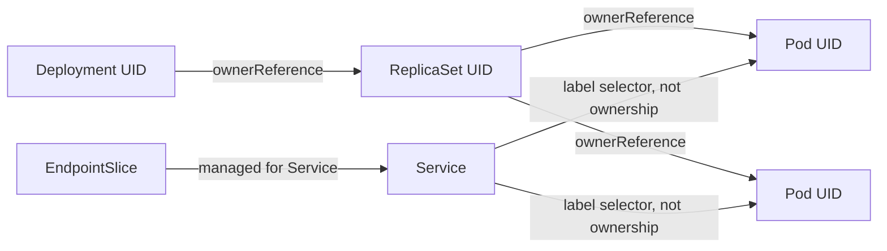

# Object To Running Pod

Why can `kubectl apply` succeed while the Pod is still absent, `Pending`, or
not receiving traffic? The API write and workload convergence are different
paths with different completion points.

> [!info] Baseline and fixture
> Reviewed against Kubernetes v1.36 documentation on 2026-07-17. The reference
> fixture is a Deployment-created, non-`hostNetwork` Pod, a selector-backed
> Service, and no persistent volume until the storage branch is named.

This page is a vertical overview. It does not define the exact request order
for every API verb, reproduce scheduler plugins, or prescribe one CNI, Service
dataplane, runtime, or CSI implementation.

## Two Different Paths

The client waits for one synchronous request:

The response proves that the desired object was accepted and persisted. It
does not wait for a ReplicaSet, Pod, scheduler binding, image pull, probe,
EndpointSlice update, or Service dataplane programming.

Afterward, several level-triggered loops converge concurrently:

Each observer can be behind a different API revision. The diagram is a
dependency graph, not a transaction.

## Object Ownership

Ownership controls lifecycle and garbage collection. A Service selector is a
query over labels; it does not own the selected Pods.

## Transition Map

| Transition | Writer or observer | Evidence | Focused command |
| --- | --- | --- | --- |
| Manifest becomes Deployment | API server request path | UID, `resourceVersion`, `generation`, `managedFields` | `kubectl get deploy web -o yaml` |
| Deployment creates ReplicaSet | Deployment controller | Deployment conditions, ReplicaSet owner reference | `kubectl get rs -l app=web -o wide` |
| ReplicaSet creates Pod | ReplicaSet controller | Pod owner reference, creation timestamp | `kubectl get pod -l app=web -o yaml` |
| Pod enters scheduling queue | scheduler observes unbound Pod | `PodScheduled=False`, scheduling Events | `kubectl describe pod POD` |
| Scheduler binds Pod | scheduler/API server | `spec.nodeName`, `PodScheduled=True` | `kubectl get pod POD -o wide` |
| Node starts Pod sync | kubelet | sandbox/image/container waiting reasons, Events | `kubectl get pod POD -o json` |
| Runtime starts processes | kubelet through CRI | container IDs, states, restart counts | `kubectl describe pod POD` |
| CNI prepares Pod network | runtime/CNI path | Pod IP, sandbox state, implementation logs | inspect only after discovering the active CNI |
| Kubelet reports readiness | kubelet probe/status path | Pod and container readiness conditions | `kubectl get pod POD -o json` |
| EndpointSlice reflects backend | EndpointSlice controller or another manager | endpoint addresses and `ready/serving/terminating` | `kubectl get endpointslice -l kubernetes.io/service-name=web -o yaml` |
| Service routes traffic | dataplane implementation | active backend set plus node/dataplane state | trace Service to EndpointSlice before node rules |

Use UID and revision fields when correlating output. Names can be reused after
deletion, Events can expire, and two commands run seconds apart do not form an
atomic snapshot.

## Where Convergence Can Stop

| Symptom | Delayed or rejected boundary | Next page |
| --- | --- | --- |
| Deployment exists, no ReplicaSet | controller observation, invalid selector/template, or controller failure | [Reconciliation](reconciliation.md) |
| Pod exists without `spec.nodeName` | combined scheduling constraints or unavailable capacity | [Scheduling](scheduling.md) |
| Pod assigned, still `ContainerCreating` | image, sandbox, CNI, CSI, or runtime transition | [Pod Lifecycle](pod_lifecycle.md) |
| Pod restarts | process exit, probe action, OOM, or runtime failure | [Pod Lifecycle](pod_lifecycle.md) and [Resources](resources.md) |
| Pod looks ready, Service has no backend | selector mismatch or EndpointSlice condition/update | [Networking](networking.md) |
| PVC is `Bound`, Pod cannot start | attach, stage, publish, filesystem, or backend failure | [Storage](storage.md) |
| Many unrelated transitions slow together | API server, etcd, or control-plane saturation | [Control Plane](control_plane.md) |

## Branches That Change The Trace

- A bare Pod has no Deployment or ReplicaSet owner.
- A static Pod is sourced from the kubelet and represented by a mirror Pod.
- A `hostNetwork` Pod does not receive an ordinary Pod network namespace from
  the CNI path.
- A selectorless or `ExternalName` Service does not follow the selector-backed
  EndpointSlice path above.
- A Pod without a persistent volume has no CSI provisioning or attach branch.
- A static PV skips dynamic provisioning; storage topology may still affect
  scheduling and node publication.

## What This Does Not Mean

- `apply` success does not mean rollout success.
- `Running` phase does not mean ready, healthy, or serving traffic.
- Pod readiness does not create Service ownership.
- `Bound` PVC does not mean attached, mounted, writable, or durable.
- One warning Event does not prove a root cause.
- Kubernetes does not execute the arrows above as one ordered workflow.

## Operational Entry Points

- [kubectl commands](hacks/kubernetes/kubectl.md)
- [API observation](hacks/kubernetes/api.md)
- [Symptom-first troubleshooting](hacks/kubernetes/troubleshooting.md)

## References

- [Kubernetes components](https://kubernetes.io/docs/concepts/overview/components/)
- [Deployments](https://kubernetes.io/docs/concepts/workloads/controllers/deployment/)
- [Pod lifecycle](https://kubernetes.io/docs/concepts/workloads/pods/pod-lifecycle/)
- [EndpointSlices](https://kubernetes.io/docs/concepts/services-networking/endpoint-slices/)
