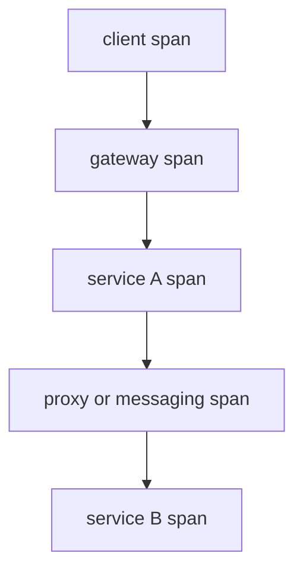

# Kubernetes Observability And Tracing

Observability is the ability to ask a bounded question and correlate evidence
across owners. Installing a collector does not create that model.

> [!info] Baseline
> Reviewed against OpenTelemetry documentation on 2026-07-17. Profiles are an
> alpha OpenTelemetry signal; treat their pipeline as version-sensitive.

## Signals Answer Different Questions

| Signal | Primary question | Common blind spot |
| --- | --- | --- |
| metric | how much, how often, how saturated? | individual causal path |
| log | what discrete event did one component report? | missing context and sampling |
| trace | how did one request cross process boundaries? | uninstrumented work and sampling gaps |
| profile | which code consumed CPU or other resources? | external waits and request coverage |
| Kubernetes object/status | what state was desired or reported? | node/kernel reality and freshness |
| flow/packet evidence | where did network traffic pass or drop? | application meaning |

No signal is the source of truth for every layer.

## Trace Model

A trace is a graph of spans. Each span represents an operation with a trace ID,
span ID, parent relationship, timestamps, attributes, events and status.



Context propagation carries the causal identity across boundaries. The default
OpenTelemetry propagator uses W3C Trace Context for HTTP headers. A proxy can
forward headers, but application or messaging instrumentation must still
extract and inject context at its own boundaries.

Do not place credentials, targeting data or personal information in baggage.
Baggage propagates beyond the process and can appear in logs or downstream
systems.

## Missing Span Diagnosis

Find the last known parent and first known downstream operation:

1. inspect the outgoing carrier at the sender;
2. verify proxy/header policy did not remove or rewrite context;
3. verify receiver extraction and parent creation;
4. inspect async queue/message propagation;
5. compare sampling decisions and exporter health;
6. prove clock skew is not only distorting duration/order.

A missing span can mean missing instrumentation, rejected context, sampling,
queue loss, collector backpressure or application failure before export.

## Sampling

Head sampling decides early and is efficient, but cannot inspect the completed
trace. Tail sampling buffers enough of a trace to select errors, high latency
or other completed properties, which costs memory, time and coordination.

Sampling belongs in the reliability design:

- preserve rare errors and high-latency paths;
- avoid independent decisions that fragment one distributed trace;
- bound collector queues and export retries;
- expose dropped spans and failed exports as telemetry;
- protect application resources from the observability pipeline.

## Kubernetes Deployment Patterns

| Pattern | Strength | Boundary |
| --- | --- | --- |
| in-process SDK | richest application semantics | code/runtime overhead and lifecycle |
| auto-instrumentation | fast library coverage | opaque gaps and version compatibility |
| sidecar collector | Pod-local isolation/routing | per-Pod resources and lifecycle |
| node agent/DaemonSet | shared host collection | tenant isolation and node pressure |
| gateway collector | centralized policy/export | network dependency and aggregation pressure |

Use multiple tiers only with explicit ownership for retry, queueing, sampling
and backpressure.

## Correlation Spine

For one production question retain:

```text
cluster / namespace / workload / Pod UID
container and restart identity
node and zone
trace ID / span ID / request ID
object generation or resourceVersion where relevant
monotonic duration plus wall-clock timestamp
release and configuration revision
```

High-cardinality identifiers belong in traces or logs, not automatically in
metric labels.

## Edge Telemetry Budget

Disconnected nodes need store-and-forward policy before a collector is added:

- maximum bytes and write rate;
- disk quota and retention priority;
- behavior when the queue is full;
- compression and batch size;
- reconnect bandwidth and backoff;
- which evidence must remain local;
- which fields cross trust boundaries.

Prefer local aggregation for high-volume healthy traffic and retain bounded
detail for failures. A link restoration must not trigger an export storm that
starves the workload.

## Failure Map

| Symptom | Boundary | Evidence |
| --- | --- | --- |
| trace stops at gateway | propagation or receiver instrumentation | carrier, proxy config and receiver SDK |
| all spans share wrong service | resource detection/config | collector transform and SDK resource |
| collector OOM | cardinality, queue or tail-sampling buffer | receiver rate, queue/drop metrics, heap profile |
| timestamps run backward | clock synchronization | node offsets and monotonic durations |
| application slows during outage | exporter retry/backpressure | SDK queue, collector link state and CPU/I/O |
| Hubble flow exists, no span | network versus application instrumentation | flow tuple, proxy/application context |

## What This Does Not Mean

- Tracing replaces metrics, logs or packet evidence.
- A shared trace ID proves timestamps are synchronized.
- 100% sampling guarantees complete traces under overload.
- A mesh creates application spans automatically for every protocol.
- More labels always improve diagnostics.

See [Service Mesh](service_mesh.md), [Packet Path](networking/packet_path.md),
and [Edge Kubernetes](edge.md).

## References

- [OpenTelemetry concepts](https://opentelemetry.io/docs/concepts/)
- [Context propagation](https://opentelemetry.io/docs/concepts/context-propagation/)
- [Sampling](https://opentelemetry.io/docs/concepts/sampling/)
- [OpenTelemetry components](https://opentelemetry.io/docs/concepts/components/)
- [Kubernetes system component traces](https://kubernetes.io/docs/concepts/cluster-administration/system-traces/)
