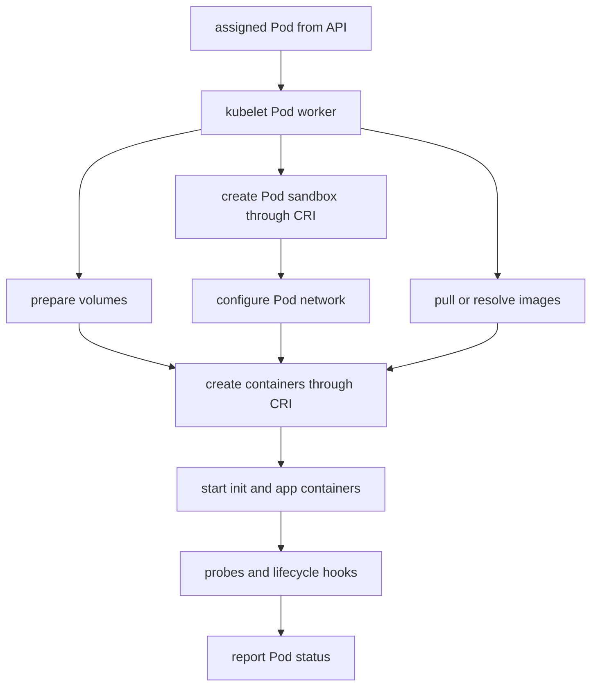

# Kubernetes Pod Lifecycle

Once `spec.nodeName` is set, `ContainerCreating`, `ImagePullBackOff`, and
`CrashLoopBackOff` are node execution symptoms. The scheduler has finished its
job; kubelet and node-local dependencies now reconcile the Pod.

> [!info] Baseline
> Reviewed against Kubernetes v1.36 documentation on 2026-07-17. Runtime, CNI,
> image credential provider, log paths, and system service layout depend on the
> cluster and node operating system.

This page focuses on a normal API-sourced Linux Pod. Static Pods, Windows Pods,
user namespaces, and specialized runtimes branch from this path.

## Kubelet Pod Sync



The exact internal ordering and retry boundaries vary. The invariant is that
kubelet repeatedly drives node-local state toward the assigned Pod spec and
reports observations through status.

CRI separates kubelet from the container runtime. CNI plugins commonly enter
through sandbox network setup, while CSI node plugins handle volume staging and
publication. A waiting reason can therefore summarize a failure below kubelet.

## Phase Is Coarse; Status Is Specific

Pod phase is a small summary: `Pending`, `Running`, `Succeeded`, `Failed`, or
`Unknown`. Use per-container state and conditions for diagnosis:

- `waiting.reason` explains why a container has not started;
- `terminated.reason`, exit code, signal, and timestamps explain the last exit;
- `restartCount` shows kubelet restarts within this Pod identity;
- init container status can block all app containers;
- Pod conditions separate scheduling, initialization, container readiness, and
  overall readiness.

`Running` means the Pod is bound and at least one container is running,
starting, or restarting. It does not mean every container is ready.

## Probes Have Different Effects

| Probe | Failure effect |
| --- | --- |
| startup | suppresses liveness/readiness until startup succeeds; eventual failure restarts the container |
| readiness | removes readiness and normally the endpoint from ready Service backends |
| liveness | causes kubelet to terminate and restart the container according to policy |

A probe observes from kubelet's execution context, not necessarily from a user
or external load balancer. Aggressive timeouts can convert dependency latency
into self-inflicted restarts.

## Restart And Backoff

Kubelet applies the Pod/container restart policy to terminated containers.
Repeated failures lead to exponential restart delay, surfaced as
`CrashLoopBackOff`. The backoff is a symptom and protection mechanism; inspect
the previous termination and previous logs for the cause.

An OOM termination, failed liveness probe, application exit, and runtime error
can all produce restarts but require different evidence.

## Termination

For ordinary graceful deletion, the API marks the Pod for deletion, endpoints
can begin changing, kubelet runs any `preStop` hook, sends the configured stop
signal (normally TERM), waits within the grace period, and eventually forces
remaining processes to stop. Controllers can create replacements concurrently.

Hook execution, endpoint propagation, signal handling, and application drain
are not one transaction. A process can still receive traffic during parts of
termination unless the application and routing design account for it.

Force deletion removes the API object without waiting for confirmation that
node processes stopped. Use it as a failure-recovery choice, not routine speed.

## Failure Map

| Evidence | Likely boundary | Next check |
| --- | --- | --- |
| `ErrImagePull` / `ImagePullBackOff` | image reference, registry, auth, or network | exact image, waiting message, node egress |
| `CreateContainerConfigError` | referenced config or invalid runtime input | message, ConfigMap/Secret existence and keys |
| long `ContainerCreating` | sandbox, CNI, CSI, image, or runtime | Pod Events then node component evidence |
| `CrashLoopBackOff` | repeated process/probe/OOM failure | previous state and `logs --previous` |
| `Running`, not ready | readiness/startup probe or readiness gate | conditions and probe result |
| exit `137` / `OOMKilled` | memory limit or node OOM path | container state and cgroup/node evidence |
| Pod stuck `Terminating` | kubelet unreachable, volume detach, finalizer, or process shutdown | deletion timestamp, node, finalizers, Events |

## Read-Only Evidence

```bash
kubectl get pod POD -o wide
kubectl get pod POD -o json
kubectl describe pod POD
kubectl logs POD --all-containers
kubectl logs POD --all-containers --previous
```

Logs are container output, not durable Pod history. `--previous` covers the
previous instance in the same Pod and may be unavailable after node loss or log
rotation.

## What This Does Not Mean

- `Running` does not mean ready or serving.
- `CrashLoopBackOff` is not the application exit reason.
- A successful readiness probe does not prove external reachability.
- Deleting a Pod does not synchronously delete its process everywhere.
- The Docker CLI is not the Kubernetes CRI interface.

Use [kubectl commands](hacks/kubernetes/kubectl.md) for focused status and
log queries and [node maintenance](hacks/kubernetes/node_maintenance.md)
before changing a node.

## References

- [Pod lifecycle](https://kubernetes.io/docs/concepts/workloads/pods/pod-lifecycle/)
- [Container Runtime Interface](https://kubernetes.io/docs/concepts/architecture/cri/)
- [Probes](https://kubernetes.io/docs/concepts/configuration/liveness-readiness-startup-probes/)
- [Pod termination flow](https://kubernetes.io/docs/concepts/workloads/pods/pod-lifecycle/#pod-termination-flow)
