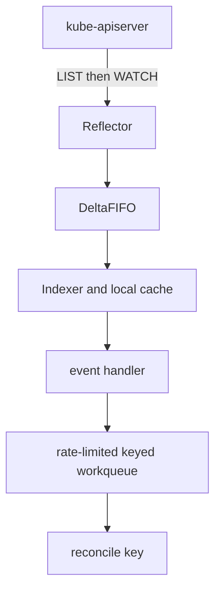
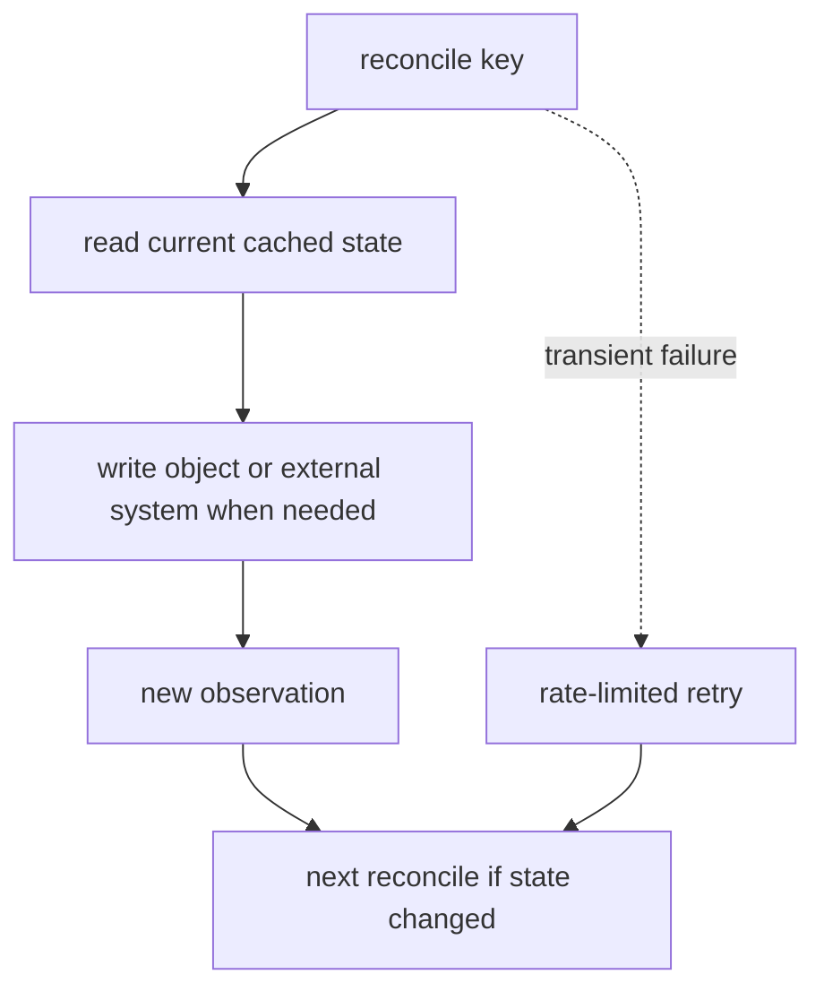

# Kubernetes Reconciliation

When `spec` changes but `status` does not, the API may be healthy while a
controller is delayed, repeatedly failing, or observing an older revision.
Kubernetes convergence is the product of independent control loops, not one
workflow transaction.

> [!info] Baseline
> Reviewed against Kubernetes v1.36 documentation on 2026-07-17. The
> reflector/informer/workqueue path below is a common client-go design, not a
> requirement for every controller implementation.

This page covers the mechanics shared by controllers. It does not prescribe a
specific operator framework or prove that every custom controller is correct.

## The Level-Triggered Contract

A reconciler compares desired state with its latest observation, takes an
idempotent step, and records useful status. It must remain correct if events
are duplicated, coalesced, reordered across objects, or lost before a relist.

```text
desired state - observed state -> action -> new observation -> repeat
```

Events are hints that work may exist. The current object state is authoritative
for the next decision. This is why a controller normally queues an object key,
not a serialized instruction such as "add replica number 4".

## A Common Controller Path



The worker closes a separate feedback loop:



An informer starts with a list, fills its cache, and watches subsequent
changes. Workers should wait for initial cache sync; otherwise "not found" may
only mean "not observed yet". A resync reprocesses cached objects. It is not a
consistency guarantee and is not necessarily a new API LIST.

Deletion events can arrive as tombstones when the final object is no longer in
the cache. Correct handlers tolerate that case.

## Keys, Coalescing, And Retries

A keyed queue deliberately collapses repeated notifications for the same
object. While one key is being processed, more changes can mark it dirty so it
runs again after completion. This bounds redundant work without assuming each
event is processed exactly once.

On a transient failure the worker usually requeues the key with rate-limited
backoff. On success it forgets prior retry history. A permanent invalid spec
should normally produce an explicit condition rather than spin forever.

Multiple workers introduce concurrency across keys. Reconciliation of related
objects can interleave, and an API write can conflict with another writer.
Idempotence, optimistic concurrency, and ownership boundaries matter more than
event order.

## Spec, Status, And Conditions

`spec` is desired state. `status` is an observation made by a controller or
node agent. A robust condition includes a type, status, reason, message, and
transition time. Where supported, `observedGeneration` lets a reader determine
whether status accounts for the current desired generation.

`Ready=True` without a matching observed generation may describe the previous
spec. Conversely, a temporarily stale condition is not evidence that the API
lost the write.

## Ownership, Deletion, And Finalizers

An `ownerReference` links a dependent object's lifecycle to an owner UID.
Garbage collection uses this graph; labels and name prefixes do not establish
ownership.

Deletion with finalizers is a protocol:

1. The API server sets `deletionTimestamp` but retains the object.
2. Responsible controllers observe deletion and clean external or dependent
   state idempotently.
3. Each controller removes only the finalizer it owns.
4. The API server can remove the object after the list is empty.

A stuck `Terminating` object often means cleanup cannot complete or its
controller no longer runs. Removing a finalizer manually abandons that contract
and can leak infrastructure.

## External Systems

An operator that controls a cloud API, database, or DNS provider crosses two
sources of truth. It needs a durable correlation identifier, idempotent create
and delete operations, bounded retries, and recovery after a crash between an
external side effect and the Kubernetes status update.

## Failure Map

| Evidence | Likely mechanism | Question to answer |
| --- | --- | --- |
| generation advances, status does not | controller has not observed or completed work | is the controller running and cache synced? |
| repeated conflicts | concurrent writers or stale reads | which field and manager owns the update? |
| queue depth and retries grow | downstream failure or hot key | is latency global, per object, or per dependency? |
| object stays `Terminating` | finalizer cleanup blocked | which finalizer remains and which controller owns it? |
| dependent survives owner deletion | invalid/missing ownership or GC delay | do owner UID, scope, and reference match? |
| status oscillates | controllers disagree or observation is unstable | are two reconcilers writing the same fields? |

## Read-Only Evidence

```bash
kubectl get deploy web -o jsonpath='{.metadata.generation}{"\n"}{.status.observedGeneration}{"\n"}'
kubectl get deploy web -o yaml --show-managed-fields
kubectl get pod POD -o jsonpath='{.metadata.ownerReferences}{"\n"}'
kubectl get RESOURCE NAME -o jsonpath='{.metadata.deletionTimestamp}{"\n"}{.metadata.finalizers}{"\n"}'
```

Controller logs and metrics are implementation-specific. Discover the active
controller and its deployment before assuming a namespace or label.

## What This Does Not Mean

- A watch event is not a command that must execute once.
- Cache staleness is not automatically a controller bug.
- A periodic resync does not make several objects an atomic snapshot.
- An owner reference does not impose creation order.
- Force-removing a finalizer is not successful cleanup.

Use [Symptom-first troubleshooting](hacks/kubernetes/troubleshooting.md) for an
evidence ladder. The deterministic `scripts/k8s/reconcile_queue.py` lab isolates
keyed queue behavior without requiring a cluster.

## References

- [Kubernetes controllers](https://kubernetes.io/docs/concepts/architecture/controller/)
- [Garbage collection](https://kubernetes.io/docs/concepts/architecture/garbage-collection/)
- [Finalizers](https://kubernetes.io/docs/concepts/overview/working-with-objects/finalizers/)
- [client-go controller example](https://github.com/kubernetes/client-go/tree/master/examples/workqueue)
