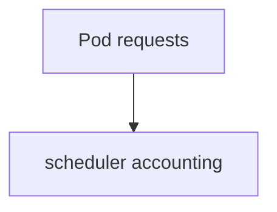
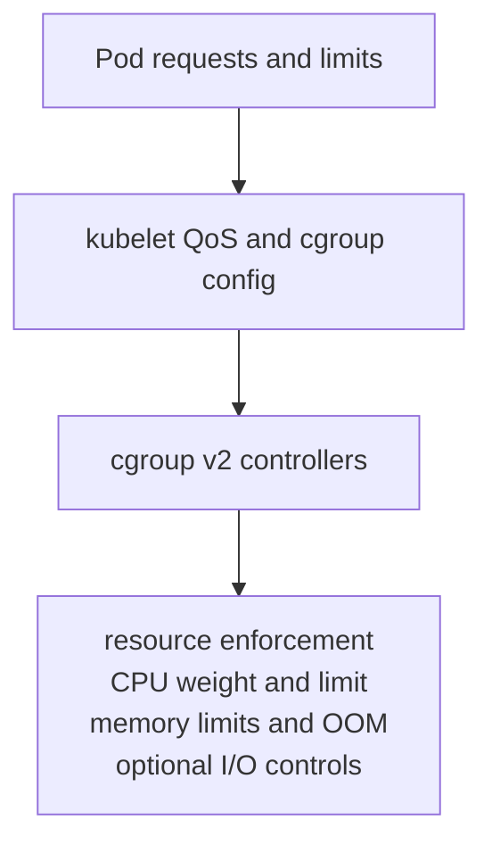

# Kubernetes Resources

CPU throttling, an `OOMKilled` container, and a node-pressure eviction can all
look like "not enough resources", but they occur at different enforcement
boundaries and need different evidence.

> [!info] Baseline
> Reviewed against Kubernetes v1.36 documentation on 2026-07-17. This page uses
> Linux cgroup v2 as the lower-level model; Windows and cgroup v1 differ. Pod-
> level resource features and in-place resize require version/feature checks.

This page covers CPU, memory, and local ephemeral-storage fundamentals. It does
not size applications or replace runtime-specific cgroup inspection.

## Four Different Numbers

| Value | Used by | Meaning |
| --- | --- | --- |
| request | scheduler and some control policies | capacity reserved for placement/accounting |
| limit | kubelet/runtime/kernel enforcement path | upper constraint where the resource supports it |
| usage | metrics and kernel counters | recent or cumulative consumption |
| allocatable | scheduler | node capacity offered to Pods after reservations |

Requests are not a warm reservation of CPU cycles or memory pages. Limits are
not scheduler capacity unless they also become requests through defaults or
explicit configuration.



The node enforcement path consumes both requests and limits:



## CPU And Memory Differ

CPU is compressible: exceeding a CPU limit normally results in throttling, not
process termination. Requests influence relative scheduling weight and
placement; runtime policy controls the exact cgroup mapping.

Memory is incompressible. When a cgroup cannot satisfy memory within its limit,
the kernel can invoke an OOM kill in that cgroup. Under system-wide pressure,
the kernel and kubelet may make different victim decisions. Exit code alone is
insufficient; container termination reason and node evidence distinguish paths.

## QoS Classes

Kubernetes classifies Pods as `Guaranteed`, `Burstable`, or `BestEffort` from
their resource declarations. QoS influences cgroup configuration and eviction/
OOM preference, but it is not an absolute survival guarantee.

- `Guaranteed` requires matching CPU and memory requests and limits for every
  relevant container.
- `BestEffort` has no CPU or memory requests or limits.
- Other combinations are `Burstable`.

Admission defaults such as a LimitRange can change the effective object, so
inspect the stored Pod rather than only the source manifest.

## Node Pressure And Eviction

Kubelet monitors signals such as available memory, node filesystem space and
inodes, image filesystem capacity, and PIDs. Crossing configured thresholds can
trigger node-pressure eviction. This is a node-local protective mechanism, not
the same as API-initiated eviction used by `drain`.

Eviction selection considers whether usage exceeds requests, Pod priority, and
relative excess depending on the resource signal. A PDB does not protect
against node-pressure eviction.

Local ephemeral-storage accounting includes selected writable layers, logs,
and `emptyDir` usage according to node configuration. DiskPressure may reflect
bytes or inodes and may involve separate node/image filesystems.

## Failure Map

| Evidence | Boundary | Interpretation |
| --- | --- | --- |
| CPU throttling counters rise | cgroup CPU controller | workload is hitting a CPU bandwidth constraint |
| `OOMKilled`, limit reached | container cgroup | memory limit enforcement is likely |
| node kernel OOM evidence | node memory pressure | system-wide allocation failed; identify victim context |
| Pod `Evicted`, pressure reason | kubelet eviction manager | node threshold crossed; Pod will not restart in place |
| `FailedScheduling: Insufficient ...` | scheduler accounting | requested capacity does not fit current nodes |
| quota or LimitRange rejection | admission | namespace policy rejected or defaulted the request |
| DiskPressure with low byte use | filesystem/inodes or image storage | check the exact pressure signal and filesystem |

## Read-Only Evidence

```bash
kubectl get pod POD -o jsonpath='{.status.qosClass}{"\n"}{.spec.containers[*].resources}{"\n"}'
kubectl top pod POD --containers
kubectl describe pod POD
kubectl describe node NODE
kubectl get resourcequota,limitrange -n NAMESPACE -o yaml
```

`kubectl top` depends on the resource metrics pipeline and shows recent usage,
not scheduler history or raw cgroup throttling/OOM counters.

## What This Does Not Mean

- A CPU request is not a hard CPU reservation.
- A memory request is not a memory limit.
- High CPU usage does not by itself prove throttling.
- `Guaranteed` does not make a Pod immune to failure or eviction.
- `kubectl top` does not explain a past OOM after metrics have moved on.

See [resource triage](hacks/kubernetes/resources.md) and the lower-level
[container foundations](ct/ct.md).

## References

- [Resource management for Pods and containers](https://kubernetes.io/docs/concepts/configuration/manage-resources-containers/)
- [Pod quality of service classes](https://kubernetes.io/docs/concepts/workloads/pods/pod-qos/)
- [Node-pressure eviction](https://kubernetes.io/docs/concepts/scheduling-eviction/node-pressure-eviction/)
- [About cgroup v2](https://kubernetes.io/docs/concepts/architecture/cgroups/)
