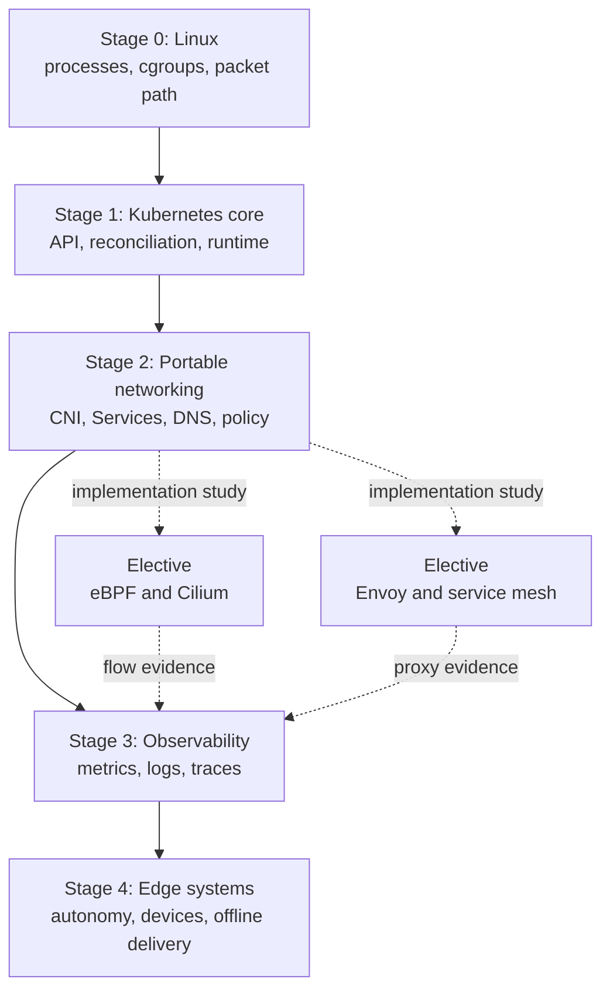

# Kubernetes Professional Roadmap

Professional depth means deriving behavior across boundaries and proving the
active implementation. Product familiarity without Linux, API, and failure
models is not the target.

> [!info] Baseline
> Reviewed against Kubernetes v1.36 and current upstream project documentation
> on 2026-07-17. Product-specific stages require a pinned lab version.

## Skill Graph

Solid arrows are core prerequisites. Dotted arrows are elective implementation
studies. Cilium is not a shortcut around routing; Istio is not a shortcut
around HTTP, TLS, and failure budgets. Neither is required before observability
or edge work.

## Evidence Standard

Every stage produces four artifacts:

| Artifact | Required proof |
| --- | --- |
| Model | Draw the actors, state owners, and packet or object transitions |
| Lab | Reproduce one success path and one controlled failure |
| Trace | Correlate object state with component and node evidence |
| Review | Explain trade-offs and rejected alternatives without product slogans |

A stage is complete when the mechanism can be explained from first principles,
observed with bounded tools, and debugged one boundary deeper than `kubectl`.

## Existing Field Evidence

Private operational notes already cover several senior-level failure domains.
Keep organization identifiers and raw output outside the Deck; extract the
mechanism, evidence order and recovery boundary.

| Sanitized case | Mechanism to preserve | Destination |
| --- | --- | --- |
| stale managed-cluster volume attachment | PVC/PV, attachment owner, finalizer, node and CSI backend state | [Storage](storage.md) |
| storage backup outage and restore tooling | reclaim policy, backend availability, GitOps drift and restore verification | [Storage](storage.md) |
| high requests blocking node maintenance | requests versus use, allocatable capacity, eviction and upgrade surge | [Resources](resources.md) |
| managed-cluster version upgrade | skew policy, CRDs, node components, workload and storage compatibility | [Control Plane](control_plane.md) |
| workload cloud identity failure | ServiceAccount identity, token projection and SDK credential chain | security track |
| long-running worker eviction | Eviction API, termination, retry ownership and Job design | [Node Lifecycle](node_lifecycle.md) |
| production ingress/egress policy | selector scope, DNS/HTTPS egress and enforcement ownership | [NetworkPolicy](networking/network_policy.md) |

The network policy case proves operational use, not complete networking depth.
Its next artifact is the disposable same-node/cross-node allow/deny matrix from
Stage 2.

## Stage 0: Linux And Networks

**Understand:** processes, file descriptors, signals, namespaces, cgroup v2,
interfaces, veth pairs, bridges, ARP/neighbor discovery, routes, forwarding,
NAT, conntrack, DNS, TCP state, MTU and fragmentation.

**Build:** on a disposable host, select an unused `/24` and run
`scripts/k8s/netns_veth_lab.sh --apply --subnet 198.18.42.0/24`; inspect
namespaces, links, addresses, routes and neighbor tables before cleanup.

**Prove:** trace a packet through same-host namespaces and explain where a
route, firewall rule, MTU mismatch, or listener can drop it.

**Interview checkpoint:** explain why `ping` can work while TCP fails, and why
one-way packet capture does not prove the return path.

**Gate:** do not advance to CNI while `ip route get`, `ip neigh`, `ss`,
`tcpdump` and conntrack roles are still interchangeable concepts.

See [Containers](ct/ct.md), [DNS](net/dns.md), [TLS](net/tls.md), and
[Packet Path](networking/packet_path.md).

## Stage 1: Kubernetes Core

**Understand:** API discovery, authentication and admission, persistence,
LIST/WATCH, ownership, reconciliation, scheduling, kubelet, CRI, Pod lifecycle,
resources, node lifecycle and etcd quorum.

**Build:** follow one Deployment-created Pod from API write to ready endpoint;
use the deterministic reconciliation queue lab.

**Prove:** distinguish desired state, cached observation, controller status,
Event, runtime state and kernel state.

**Interview checkpoint:** explain why a successful `kubectl apply` is not proof
that a container exists, and why a controller must tolerate duplicate events.

**Gate:** given a stuck Pod, identify the current owner and failed transition
before proposing a command.

See [Object To Running Pod](object_to_running_pod.md),
[Reconciliation](reconciliation.md), and [Control Plane](control_plane.md).

## Stage 2: Portable Kubernetes Networking

**Understand:** Pod network contract, sandbox creation, CNI invocation and
IPAM, same-node and cross-node routing, EndpointSlices, Service translation,
DNS, NetworkPolicy, Gateway API and implementation discovery.

**Build:** trace a Service with `scripts/k8s/service_path.py`; create an
allow/deny policy matrix on a disposable cluster with a known enforcing CNI.

**Prove:** show the same request as DNS lookup, Service frontend, selected
endpoint, node dataplane state and destination listener.

**Interview checkpoint:** a Pod IP works but ClusterIP fails on one node.
Describe the evidence order without assuming iptables or Cilium.

**Gate:** be able to name which facts come from Kubernetes API contracts and
which come from the installed CNI and Service implementation.

See [Networking](networking.md), [CNI](networking/cni.md),
[Service Dataplane](networking/service_dataplane.md), and
[NetworkPolicy](networking/network_policy.md).

## Elective A: eBPF And Cilium

**Understand:** BPF program types and attachment hooks, verifier constraints,
maps, tail calls, tc/XDP/cgroup/socket hooks, identity-based policy, Cilium
agents and operators, Hubble, tunneling versus native routing, and kube-proxy
replacement.

**Build:** deploy a pinned Cilium release in a disposable multi-node cluster;
record `cilium status`, endpoint identities, BPF service maps and Hubble flows.
Repeat one Service and one policy trace with kube-proxy replacement enabled.

**Prove:** map a Kubernetes Service or policy object to the corresponding
Cilium identity, map entry, hook and observed flow verdict.

**Interview checkpoint:** compare iptables rule traversal with BPF map lookup,
then state the operational risks of migrating between independent connection
tracking/NAT implementations.

**Gate:** do not call a path “eBPF” until its attachment point, input context,
map state and userspace owner are identified.

See [eBPF And Cilium](networking/ebpf_cilium.md) and the
[Linux BPF documentation](https://www.kernel.org/doc/html/latest/bpf/).

## Elective B: Envoy And Service Mesh

**Understand:** L4 versus L7 proxying, listeners, filter chains, routes,
clusters, endpoints, connection pools, health checks, outlier detection,
circuit breaking, xDS, mTLS identity, sidecar capture and ambient waypoints.

**Build:** run a pinned Envoy configuration first; then deploy an Istio sample
and trace one request through xDS configuration, proxy access log and
application span. Compare sidecar and ambient paths.

**Prove:** separate a Kubernetes NetworkPolicy verdict, mesh authorization
decision, Envoy route, upstream reset and application response.

**Interview checkpoint:** explain why retries can amplify an outage and why a
sidecar being ready does not prove its upstream cluster is healthy.

**Gate:** every mesh feature must map to an Envoy dataplane primitive and a
control-plane owner.

See [Service Mesh](service_mesh.md).

## Stage 3: Observability And Performance

**Understand:** metrics, logs, traces, profiles, resource attributes, semantic
conventions, context propagation, head versus tail sampling, cardinality,
collector pipelines, backpressure and telemetry failure isolation.

**Build:** propagate W3C Trace Context across two services; break propagation;
prove the missing edge in the trace and correlate it with proxy and application
logs. Define a bandwidth budget before exporting from an edge node.

**Prove:** reconstruct one request across ingress, proxy, application, network
and node signals without using timestamps as the only join key.

**Interview checkpoint:** explain why 100% tracing can reduce observability
during overload and what tail sampling needs to buffer.

**Gate:** an alert or dashboard is not complete until its owner, freshness,
cardinality, failure mode and diagnostic next step are known.

See [Observability And Tracing](observability.md).

## Stage 4: Edge And Mission-Constrained Systems

**Understand:** local autonomy during control-plane loss, single-node versus
HA trade-offs, intermittent and asymmetric links, air-gap image delivery,
signed artifacts, rollback, limited CPU/memory/storage, ARM and accelerators,
device plugins/DRA, time synchronization, local data durability and telemetry
budgets.

**Build:** operate a pinned edge cluster through link loss and restart. Prove
which existing workloads continue, which API operations fail, how images are
resolved offline, and how the previous signed release is restored.

**Prove:** produce a failure matrix for loss of cloud link, DNS, registry,
power, disk, device, clock and certificate validity.

**Interview checkpoint:** design an upgrade for 500 intermittently connected
nodes with limited bandwidth and a hard rollback deadline.

**Gate:** the system must have an explicit degraded mode. “Reconnect to the
cloud” is not a recovery design.

See [Edge Kubernetes](edge.md).

## Parallel Professional Tracks

| Track | Core depth | Evidence to produce |
| --- | --- | --- |
| Security | RBAC, admission, Pod Security, workload identity, secrets, supply chain | least-privilege review and signed offline release |
| Reliability | SLOs, disruption, capacity, backups, upgrades, failure injection | tested recovery objective and rollback record |
| Platform APIs | CRDs, controllers, finalizers, webhooks, Gateway API | idempotent reconciler with envtest and failure cases |
| Hardware | NUMA, CPU manager, huge pages, SR-IOV, device plugins, DRA | topology-aware allocation and device-failure trace |
| Delivery | OCI, SBOM, provenance, GitOps, promotion, policy | reproducible artifact promotion without live internet |

These tracks attach to the skill graph; none replaces its Linux and Kubernetes
foundations.

## Review Cadence

- Monthly: one whiteboard checkpoint and one broken lab.
- Quarterly: one sanitized incident trace rewritten as mechanism evidence.
- Per Kubernetes minor: review feature states and deprecated dataplanes.
- Per product upgrade: record version, kernel requirements, migration boundary,
  rollback method and observable acceptance checks.

Use [Interview Checkpoints](interview.md) to select the next weak boundary.

## References

- [Kubernetes cluster architecture](https://kubernetes.io/docs/concepts/architecture/)
- [CNI specification](https://www.cni.dev/docs/spec/)
- [Cilium eBPF datapath](https://docs.cilium.io/en/stable/network/ebpf/)
- [Istio data plane modes](https://istio.io/latest/docs/overview/dataplane-modes/)
- [OpenTelemetry concepts](https://opentelemetry.io/docs/concepts/)
- [K3s air-gap installation](https://docs.k3s.io/installation/airgap)
- [KubeEdge architecture](https://kubeedge.io/docs/category/architecture/)
