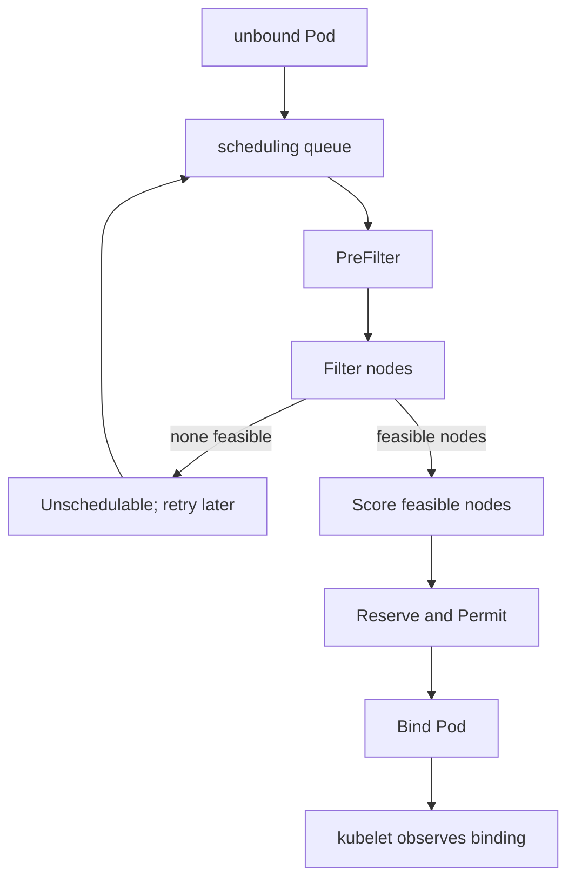

# Kubernetes Scheduling

A Pod that remains `Pending` with no `spec.nodeName` has not completed
scheduling. The useful question is not "which scheduler algorithm is best?"
but "which combined constraint made every current node infeasible?"

> [!info] Baseline
> Reviewed against Kubernetes v1.36 documentation on 2026-07-17. Enabled
> profiles, plugins, weights, extenders, and autoscaling behavior are cluster
> configuration, not universal defaults.

This page follows the default scheduler framework conceptually. It does not
model every plugin or claim that a custom scheduler uses the same pipeline.

## From Unbound Pod To Binding

The scheduler watches for Pods it is responsible for whose `spec.nodeName` is
empty. One scheduling cycle chooses a node; a separate binding cycle applies
that decision.



Filter answers whether a node is feasible. Score ranks only feasible nodes.
Adding a scoring preference cannot rescue a node rejected by a hard filter.

The scheduler uses a snapshot of cached cluster state. Nodes, Pods, claims,
and policies can change during a cycle, so plugins and binding paths must
handle conflicts and retries.

## Constraints Compose

| Input | Typical effect |
| --- | --- |
| CPU, memory, ephemeral-storage requests | reject nodes without enough allocatable capacity |
| node selector and required node affinity | restrict eligible node labels |
| taints and tolerations | reject an untolerated `NoSchedule` or `NoExecute` effect |
| pod affinity/anti-affinity | relate placement to labels and topology domains |
| topology spread constraints | limit skew across eligible domains |
| volume topology and binding mode | restrict nodes compatible with storage |
| host ports and node-specific limits | reject conflicting or exhausted node resources |
| scheduling gates | keep a Pod out of normal scheduling until gates are removed |

Requested resources drive ordinary scheduling, not recent CPU or memory usage.
A quiet Pod with a large request can block placement; a busy Pod with no request
can be cheap to the scheduler and expensive to the node.

## Queue And Retry

Pods can move between active, backoff, and unschedulable queues. Cluster events
that might make a Pod feasible can reactivate it; failed attempts use backoff.
Repeated `FailedScheduling` Events are observations from attempts, not separate
Pods or proof that capacity is the only issue.

Scheduler queue order also incorporates priority and fairness mechanisms.
Priority does not bypass hard feasibility constraints.

## Preemption

Preemption can nominate a node and evict lower-priority Pods when doing so may
make a higher-priority Pod schedulable. It is not immediate capacity:

- victims still terminate;
- disruption policy and plugin rules matter;
- another change can invalidate the plan;
- a nominated node is not a completed binding;
- preemption cannot fix node affinity, volume topology, or other non-resource
  constraints.

## Failure Map

| Evidence | Likely boundary | Next check |
| --- | --- | --- |
| `spec.nodeName` empty, `PodScheduled=False` | scheduling has not succeeded | scheduling condition and recent Events |
| `Insufficient cpu/memory` | requests exceed available allocatable capacity | Pod requests and per-node requested totals |
| node affinity mismatch | label constraint removes nodes | effective labels and required expressions |
| untolerated taint | taint filter removes nodes | taint effects and exact tolerations |
| volume node affinity conflict | storage topology conflicts with placement | PVC/PV, StorageClass binding mode, PV affinity |
| unbound immediate PVC | storage binding blocks scheduling | PVC Events and provisioner state |
| nominated node but still Pending | preemption/termination has not converged | victims, constraints, subsequent Events |
| `spec.nodeName` set | scheduling is complete | continue with Pod and node lifecycle |

## Read-Only Evidence

```bash
kubectl get pod POD -o jsonpath='{.spec.schedulerName}{"\t"}{.spec.nodeName}{"\n"}'
kubectl get pod POD -o jsonpath='{.status.conditions[?(@.type=="PodScheduled")]}{"\n"}'
kubectl describe pod POD
kubectl get nodes --show-labels
kubectl describe node NODE
```

Descriptions combine current state with recent Events and are not atomic. Use
the Pod UID when names may have been recreated.

## What This Does Not Mean

- `Pending` does not always mean scheduler failure; assigned Pods can remain
  pending while kubelet prepares them.
- Score plugins do not override Filter failures.
- Priority does not guarantee placement.
- A scheduler binding does not mean a container started.
- Simulated annealing is a useful optimization model, not kube-scheduler's
  documented implementation.

See [resource triage](hacks/kubernetes/resources.md) and
[storage triage](hacks/kubernetes/storage.md) for the two most common
cross-boundary investigations.

## References

- [Kubernetes scheduler](https://kubernetes.io/docs/concepts/scheduling-eviction/kube-scheduler/)
- [Scheduling framework](https://kubernetes.io/docs/concepts/scheduling-eviction/scheduling-framework/)
- [Assigning Pods to nodes](https://kubernetes.io/docs/concepts/scheduling-eviction/assign-pod-node/)
- [Pod priority and preemption](https://kubernetes.io/docs/concepts/scheduling-eviction/pod-priority-preemption/)
