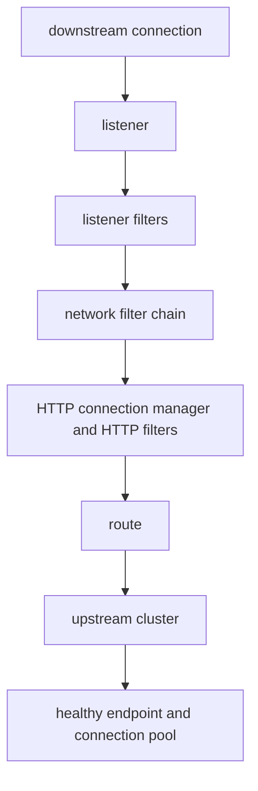
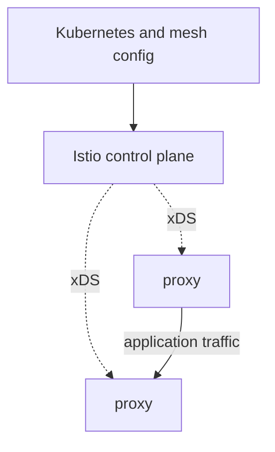
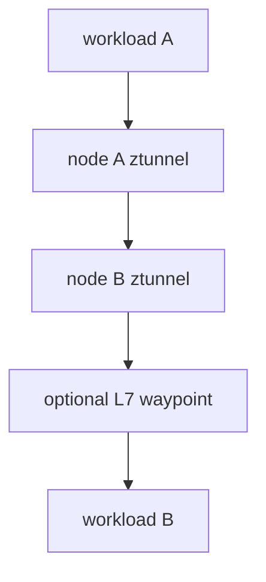

# Envoy And Kubernetes Service Mesh

A service mesh adds programmable proxy hops and workload identity. It does not
replace Kubernetes networking, application timeouts, or capacity engineering.

> [!info] Baseline
> Reviewed against Envoy and Istio upstream documentation on 2026-07-17.
> Native Kubernetes sidecar containers are stable in Kubernetes v1.33.

## Envoy Request Model



The stable vocabulary matters:

| Envoy object | Responsibility |
| --- | --- |
| listener | accepts downstream TCP or UDP traffic |
| filter chain | selects ordered connection/request processing |
| route | maps an L7 request to an action or upstream cluster |
| cluster | logical pool of upstream endpoints |
| endpoint | concrete upstream address and health state |
| connection pool | reuses and bounds upstream connections/streams |

An HTTP 503 can originate from no matching route, no healthy upstream, cluster
warming, connection-pool limits, an upstream reset, or the application. Record
the response flags and owning hop before blaming Kubernetes readiness.

## xDS Control Plane

Envoy can receive listeners, routes, clusters, endpoints and secrets through
dynamic discovery APIs commonly grouped as xDS. The control plane computes and
distributes configuration; Envoy proxies carry user traffic.



A healthy xDS stream does not prove the accepted configuration routes traffic.
Check config version, warming/rejection state and the concrete listener, route,
cluster and endpoint graph.

## Sidecar Mode

Istio sidecar mode injects an Envoy proxy beside each workload. Traffic capture
redirects selected inbound and outbound connections through it.

Costs and failure domains include:

- CPU and memory reserved per Pod;
- startup ordering and readiness interaction;
- proxy drain versus application termination;
- configuration fan-out as service count grows;
- traffic-capture exclusions and protocol detection;
- Jobs waiting on legacy sidecars or losing final telemetry;
- two L7 proxy hops for a sidecar-to-sidecar request.

Kubernetes native sidecars are restartable init containers with Pod-aware
lifecycle semantics. They solve startup/termination cases; they are not the
same thing as automatic mesh injection or traffic capture.

## Ambient Mode

Istio ambient mode moves the baseline secure L4 path into a per-node `ztunnel`.
L7 policy, routing and telemetry require an optional destination-oriented
waypoint proxy. This changes resource cost, policy attachment and the evidence
path.



Sidecar and ambient modes can coexist, but migration is not a label-only
exercise. Current Istio documentation lists limitations around feature parity,
multi-cluster cases and L7 policy transition. Pin the exact Istio release and
test the mixed-mode traffic matrix before migration.

## Failure Budgets

Retries consume time and load. If three layers each retry three times, one user
request can multiply into many upstream attempts. A timeout hierarchy must
leave time for cancellation and useful error reporting.

Circuit breaking in Envoy bounds resources such as connections, pending
requests and retries. It does not repair an unhealthy dependency. Outlier
detection changes endpoint selection and can reduce capacity further.

## Evidence Ladder

1. Prove direct application listener and Kubernetes endpoint state.
2. Identify sidecar, ztunnel, waypoint, ingress or egress proxy hops.
3. Read the accepted proxy configuration, not only desired mesh resources.
4. Correlate access log response flags, upstream cluster and endpoint.
5. Correlate trace context and application log at the same request boundary.
6. Inspect underlying CNI/policy only after locating the failed hop.

Useful bounded observations depend on the deployed version:

```bash
istioctl proxy-status
istioctl proxy-config listeners POD -n NAMESPACE
istioctl proxy-config routes POD -n NAMESPACE
istioctl proxy-config clusters POD -n NAMESPACE
```

Ambient workloads require ambient-specific `istioctl ztunnel-config` and
waypoint evidence; `proxy-status` is not a complete ambient inventory.

## Failure Map

| Symptom | Boundary | Evidence |
| --- | --- | --- |
| direct Pod IP works, mesh path fails | capture or proxy config | listeners, routes, clusters and access flags |
| proxy has no endpoint | discovery/config propagation | EndpointSlice, xDS endpoint config, warming state |
| mTLS handshake fails | identity, trust bundle, time or policy | certificate metadata, clocks and proxy logs |
| Job never completes | sidecar lifecycle | Pod spec, container states and termination order |
| retries worsen outage | retry budget and overload | attempts per request, upstream latency and saturation |
| sidecar-to-ambient policy gap | migration path | source mode, waypoint enrollment and policy attachment |

## What This Does Not Mean

- A mesh makes an application observable without context propagation.
- mTLS alone establishes application authorization.
- Envoy readiness proves every upstream cluster is healthy.
- Ambient mode has no proxies.
- NetworkPolicy and mesh authorization enforce the same layer.

See [Service Dataplane](networking/service_dataplane.md),
[NetworkPolicy](networking/network_policy.md), and
[Observability And Tracing](observability.md).

## References

- [Envoy architecture overview](https://www.envoyproxy.io/docs/envoy/latest/intro/arch_overview/arch_overview)
- [Envoy listeners](https://www.envoyproxy.io/docs/envoy/latest/intro/arch_overview/listeners/listeners)
- [Envoy cluster manager](https://www.envoyproxy.io/docs/envoy/latest/intro/arch_overview/upstream/cluster_manager)
- [Istio data plane modes](https://istio.io/latest/docs/overview/dataplane-modes/)
- [Istio ambient architecture](https://istio.io/latest/docs/ambient/architecture/)
- [Kubernetes sidecar containers](https://kubernetes.io/docs/concepts/workloads/pods/sidecar-containers/)
