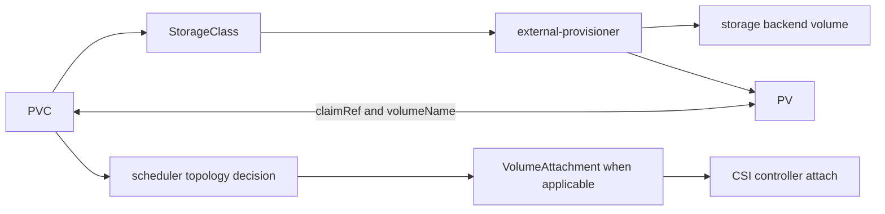
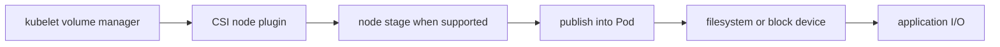

# Kubernetes Storage

A PVC can be `Bound` while a Pod remains `ContainerCreating`. Binding proves a
claim-to-volume relationship, not that a backend volume is attached, staged,
mounted, writable, healthy, or durable.

> [!info] Baseline
> Reviewed against Kubernetes v1.36 documentation on 2026-07-17. CSI driver
> capabilities, attach behavior, topology, expansion, snapshots, reclaim
> policy, and backend semantics are cluster-specific.

This page follows a dynamically provisioned persistent volume through common
CSI boundaries. Inline, ephemeral, local, in-tree, and driver-specific volumes
can skip or alter steps.

## Object And I/O Paths

The control path prepares API and backend state:



The node path makes the volume usable by one Pod:



Provision, bind, attach, stage, publish, mount, and application I/O are distinct
transitions with different actors and retry behavior.

## Binding And Topology

A PVC requests capacity, access modes, volume mode, and optionally a
StorageClass/selector. The control plane binds it to a compatible PV. Access
modes describe matching and driver-supported attachment intent; they are not
general filesystem permission or distributed locking guarantees.

With `Immediate` binding, provisioning/binding can happen before a Pod is
scheduled. With `WaitForFirstConsumer`, scheduler constraints help choose a
topology-compatible volume. This avoids provisioning in a zone the eventual Pod
cannot use, but introduces an intentional unbound-claim stage.

PV node affinity, allowed topology, Pod placement constraints, and available
capacity compose. Storage can therefore make every node infeasible.

## CSI Sidecars And Drivers

CSI separates Kubernetes control-plane integrations from node plugins. Common
sidecars watch Kubernetes objects and call driver RPCs for provisioning,
attachment, resizing, snapshots, or registration. Their names and supported
operations are deployment details.

`VolumeAttachment` is relevant only for drivers and volume modes requiring an
attach operation. Its absence is not automatically a failure. Likewise, some
drivers do not implement a separate stage step.

Retries can encounter partially completed backend operations. Stable volume
handles and idempotent CSI calls are essential when an API update, sidecar, node,
or network fails between steps.

## Filesystem And Application Semantics

After publication, ordinary operating-system rules still apply: filesystem
type, mount options, ownership, permissions, SELinux/AppArmor policy, inode and
space exhaustion, I/O errors, cache behavior, and application consistency.

Kubernetes does not turn a block device or network filesystem into a database-
consistent storage system. The backend defines durability and failure domains;
the application defines flush, locking, replication, and recovery semantics.

## Deletion, Reclaim, And Finalizers

Deleting a PVC, Pod, PV, or StorageClass triggers different paths. A PV reclaim
policy such as `Delete` or `Retain` governs what should happen after release.
Finalizers protect resources while controllers perform cleanup.

Force-removing a finalizer or manually deleting a backend volume can break the
controller's assumptions and leak or destroy data. Identify ownership, reclaim
policy, and backend identity before mutation.

## Snapshots Are Not Universal Backups

VolumeSnapshot APIs coordinate a CSI snapshot when the driver supports it.
Snapshot readiness means the controller/driver reports completion; application
consistency still requires workload-specific quiescing or coordination. A
snapshot in the same failure domain and account may not satisfy backup goals.

## Failure Map

| Evidence | Likely boundary | Next check |
| --- | --- | --- |
| PVC `Pending`, no PV | class, provisioner, capacity, selector, or topology | PVC Events, class, provisioner status |
| `WaitForFirstConsumer` PVC pending | intentional scheduling dependency or no feasible topology | Pod scheduling Events and class mode |
| PVC `Bound`, Pod unschedulable | PV node affinity/topology or attach limit | Pod Events, PV affinity, node limits |
| attach timeout | CSI controller/backend/node reachability | VolumeAttachment if applicable, driver evidence |
| mount/setup failed | CSI node, filesystem, credentials, or permissions | Pod Events and driver/kubelet logs |
| mounted but I/O fails | filesystem/backend/application boundary | node kernel, mount, backend health |
| object stuck deleting | finalizer cleanup or unreachable backend | finalizer owner and controller retries |
| snapshot not ready | snapshot controller/driver/backend | snapshot content, class, driver Events |

## Read-Only Evidence

```bash
kubectl get pvc,pv -o wide
kubectl describe pvc CLAIM
kubectl get storageclass -o yaml
kubectl get pv VOLUME -o yaml
kubectl get volumeattachment -o wide
kubectl get volumesnapshot,volumesnapshotcontent -A
```

Snapshot resources are optional CRDs and the last command can legitimately
report that the resource type is unavailable.

## What This Does Not Mean

- `Bound` does not mean mounted or healthy.
- `ReadWriteMany` does not guarantee application-safe concurrent writes.
- A missing `VolumeAttachment` does not prove CSI is broken.
- A ready snapshot does not guarantee application consistency.
- Deleting a claim does not have one universal backend outcome.

Use [storage triage](hacks/kubernetes/storage.md) to correlate the objects in
the correct order before any recovery action.

## References

- [Persistent volumes](https://kubernetes.io/docs/concepts/storage/persistent-volumes/)
- [Storage classes](https://kubernetes.io/docs/concepts/storage/storage-classes/)
- [CSI volume lifecycle](https://kubernetes-csi.github.io/docs/)
- [Volume snapshots](https://kubernetes.io/docs/concepts/storage/volume-snapshots/)
