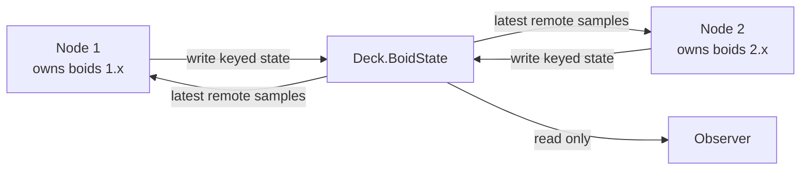

# Boids over DDS

Boids produces flocking from three local steering rules. No agent knows the
shape of the complete flock and no coordinator draws its trajectory:

1. **separation:** steer away from neighbours that are too close;
2. **alignment:** steer toward the neighbours' average velocity;
3. **cohesion:** steer toward the local centre of mass.

The distributed lab assigns different boids to different processes and shares
their state through DDS. Each process therefore applies the same local rules to
an incomplete, delayed view of the flock.

> [!info] Algorithm plus middleware
> Boids does not require DDS. The `local` mode tests the flocking algorithm by
> itself. DDS adds discovery, typed keyed state, QoS, lifecycle events, and
> asynchronous failure modes; it does not improve the steering rules.

## Local Model

A boid has a position \(p_i\) and velocity \(v_i\). Its neighbourhood contains
agents within a perception radius \(r_p\):

$$
N_i = \{j \ne i : distance(p_i, p_j) \le r_p\}
$$

The lab calculates three bounded steering vectors from one immutable snapshot:

$$
a_i = w_s S_i + w_a A_i + w_c C_i
$$

| Vector | Direction |
| ------ | --------- |
| \(S_i\) | Away from neighbours inside the separation radius |
| \(A_i\) | From \(v_i\) toward the neighbours' mean velocity |
| \(C_i\) | From \(p_i\) toward the neighbours' local centre |

Acceleration and speed are capped before integration:

$$
v_i' = limit(v_i + a_i \Delta t, v_{max})
$$

$$
p_i' = wrap(p_i + v_i' \Delta t)
$$

The world is a torus: leaving the right edge enters from the left. Neighbour
distances use the shortest wrapped displacement, so two agents next to opposite
edges remain close. Computing a normal Cartesian average of their positions
would incorrectly place their centre near the middle of the world; the lab
averages wrapped displacement vectors instead.

All local agents advance synchronously from the old snapshot. Updating them in
place would make the result depend on iteration order.

## Complexity

The implementation deliberately compares every owned boid with every visible
boid. For \(n\) total agents, a one-process step costs \(O(n^2)\).

A production simulation normally partitions space into grid cells, a quadtree,
or another spatial index. Then an agent checks nearby partitions instead of the
entire flock. Distribution alone does not remove the quadratic work: every DDS
node in this lab still subscribes to the global state topic.

## DDS Data Model

Every agent is one keyed DDS instance:

```text
Topic: Deck.BoidState

@key boid_id
owner_id
tick
x, y
vx, vy
```

The key matters. `KEEP_LAST(1)` retains the latest sample **per `boid_id`**, not
one sample for the complete topic. Without a key, a history depth of one could
leave a reader with only the last boid written.

`owner_id` records which process is allowed to integrate that agent. Nodes
discard their own looped-back samples and never update remote agents. IDs are
constructed as `owner_id * 1_000_000 + local_index`, which is sufficient for
this controlled lab but is not a general distributed identity scheme.



## One Node Tick

Each process repeats this finite loop:

```text
take available DDS samples
discard older ticks and own loopback samples
remove remote state that exceeded stale-after
combine owned state with the remote cache
advance only owned boids
publish one keyed sample per owned boid
sleep until the next wall-clock tick
```

This is not a barrier. Node 1 may calculate tick 40 while seeing tick 39 from
Node 2 and tick 37 from a delayed Node 3. `tick` rejects reordering from one
writer generation; the DDS publication handle distinguishes a restarted writer
whose counter returns to zero. Neither creates a globally synchronized
simulation step.

## QoS Profile

The lab creates matching reader and writer QoS:

| Policy | Default | Reason |
| ------ | ------- | ------ |
| Reliability | `BEST_EFFORT` | A newer position normally supersedes a lost one |
| Durability | `VOLATILE` | The lab has no requirement to replay departed writers |
| History | `KEEP_LAST(1)` | Retain only the newest sample for each keyed boid |

Passing `--reliable` changes every endpoint to `RELIABLE` with a bounded writer
blocking time. All participants in one run should use the same choice. In DDS
requested/offered matching, a reliable writer can satisfy a best-effort reader,
but a best-effort writer cannot satisfy a reader requesting reliability.

The remote application cache has its own `--stale-after` timer. DDS history QoS
controls samples retained by the middleware; it does not delete a Python object
that the application already copied into a dictionary.

When a writer disposes or unregisters a keyed instance, Cyclone DDS may deliver
an invalid-data lifecycle sample containing only the key and `SampleInfo`. The
reader handles that separately and removes the instance instead of trying to
decode it as a normal position update.

## DDS Dependency

Cyclone DDS is loaded into an ephemeral uv environment so the rest of Deck does
not require native DDS bindings:

```bash
uv run --with 'cyclonedds>=11.0.1,<12' \
  python scripts/net/boids_dds.py node --help
```

This uses the official Cyclone DDS Python wheel. Prebuilt wheels include the
runtime needed for this lab but omit features such as DDS Security and Iceoryx
shared-memory integration. Build against a system Cyclone DDS when those
features matter.

## Run Locally

The local mode needs no DDS installation and is deterministic:

```bash
# Check geometry, golden output, cache ordering, lifecycle, and limits
uv run python scripts/net/boids_dds.py self-test

# Print final flock metrics
uv run python scripts/net/boids_dds.py local

# Write a standalone Plotly animation; no server is started
uv run python scripts/net/boids_dds.py local \
  --html /tmp/boids-local.html
```

The fixed seed makes comparisons between rule weights reproducible.

## Run over DDS

Start the observer before the writers so its volatile reader sees the complete
finite run. The defaults make each node run for about 11 seconds, including
discovery, while the observer records for 12 seconds.

```bash
domain=42
pids=()

cleanup() {
  if ((${#pids[@]})); then
    kill "${pids[@]}" 2>/dev/null || true
    wait "${pids[@]}" 2>/dev/null || true
  fi
}
trap cleanup EXIT

uv run --with 'cyclonedds>=11.0.1,<12' \
  python scripts/net/boids_dds.py observe \
  --domain "$domain" --seconds 12 --html /tmp/boids-dds.html &
pids+=("$!")

uv run --with 'cyclonedds>=11.0.1,<12' \
  python scripts/net/boids_dds.py node \
  --domain "$domain" --node-id 1 --agents 20 &
pids+=("$!")

uv run --with 'cyclonedds>=11.0.1,<12' \
  python scripts/net/boids_dds.py node \
  --domain "$domain" --node-id 2 --agents 20 &
pids+=("$!")

wait "${pids[@]}"
pids=()
trap - EXIT
```

The commands terminate by themselves. The observer writes a static interactive
animation with a separate colour for each owner. It never starts an HTTP
server.

All participants must share the domain, topic name, wire type, world size, and
steering parameters. DDS discovers compatible endpoints; it does not distribute
application configuration automatically.

## Reading the Metrics

Nodes periodically print JSON records. The observer prints both its largest
snapshot and its final active cache, which may be empty after every writer has
unregistered:

```json
{"boids": 40, "mean_neighbours": 8.4, "mean_speed": 6.1, "mode": "node-1", "owners": 2, "polarization": 0.73, "tick": 200}
{"boids": 40, "mean_neighbours": 8.2, "mean_speed": 6.0, "mode": "observer-peak", "owners": 2, "polarization": 0.71, "poll": 120}
{"boids": 0, "mean_neighbours": 0.0, "mean_speed": 0.0, "mode": "observer-final", "owners": 0, "polarization": 0.0, "poll": 120}
```

| Metric | Interpretation |
| ------ | -------------- |
| `boids` | Owned plus currently cached remote agents |
| `owners` | Distinct process owners visible in that snapshot |
| `polarization` | Magnitude of mean unit heading; 0 is disordered, 1 aligned |
| `mean_neighbours` | Mean visible agents inside perception radius |
| `mean_speed` | Mean velocity magnitude |
| `tick` | Simulation counter published by a node |
| `poll` | Observer sampling count, not a DDS simulation tick |

Polarization is not a universal quality score. A flock circling an obstacle can
be coherent while its global headings cancel. Use the metrics to compare
controlled runs, not to declare one visual pattern correct.

## Experiments

### Ablate One Rule

```bash
uv run python scripts/net/boids_dds.py local \
  --cohesion-weight 0 --html /tmp/boids-no-cohesion.html
```

Removing separation tends to permit crowding; removing alignment weakens common
heading; removing cohesion lets groups disperse. Exact results depend on the
other weights and radii.

### Compare Reliability

Run all three DDS processes with `--reliable`, then compare wall time and
behaviour under induced loss. Reliable delivery can recover samples but may
add retransmission, queuing, and writer blocking. For rapidly superseded state,
recovering every old sample is not automatically useful.

### Stop One Owner

Terminate one node during a longer run. Other nodes may use its last positions
until `--stale-after` expires or a lifecycle event arrives. This exposes the
difference between writer discovery, instance lifecycle, and application-level
failure policy.

### Scale the Flock

Increase `--agents` while measuring CPU and network traffic. Because the lab
uses all-to-all visibility and an \(O(n^2)\) neighbour scan, adding DDS nodes can
increase total work instead of reducing it. A scalable design needs spatial
partitioning, content filters, or region ownership.

## What the Lab Does Not Model

- obstacle avoidance, predators, goals, or collision physics;
- spatial indexing or DDS content-filtered topics;
- ownership transfer when a boid crosses a region boundary;
- synchronized simulation time or deterministic replay across processes;
- clock synchronization, hard real-time scheduling, or bounded network delay;
- DDS Security, shared memory, persistence, or cross-language generated IDL.

The handwritten Python `IdlStruct` is convenient for one-language experiments.
For cross-language interoperability, define the type in an `.idl` file and
generate bindings with `idlc`.

## See Also

- [DDS](dds.md) — domains, topics, QoS, RTPS, and ROS 2
- [Consensus](consensus.md) — agreement under faults, which this lab does not
  provide
- [Networking](net.md) — section index

## References

- [Flocks, Herds, and Schools: A Distributed Behavioral Model](https://doi.org/10.1145/37401.37406)
- [Craig Reynolds: Boids](https://www.red3d.com/cwr/boids/)
- [OMG Data Distribution Service](https://www.omg.org/spec/DDS/)
- [Cyclone DDS Python API](https://cyclonedds.io/docs/cyclonedds-python/latest/)
- [Cyclone DDS Python IDL](https://cyclonedds.io/docs/cyclonedds-python/latest/idl.html)
- [Cyclone DDS QoS](https://cyclonedds.io/docs/cyclonedds/latest/about_dds/qos.html)
