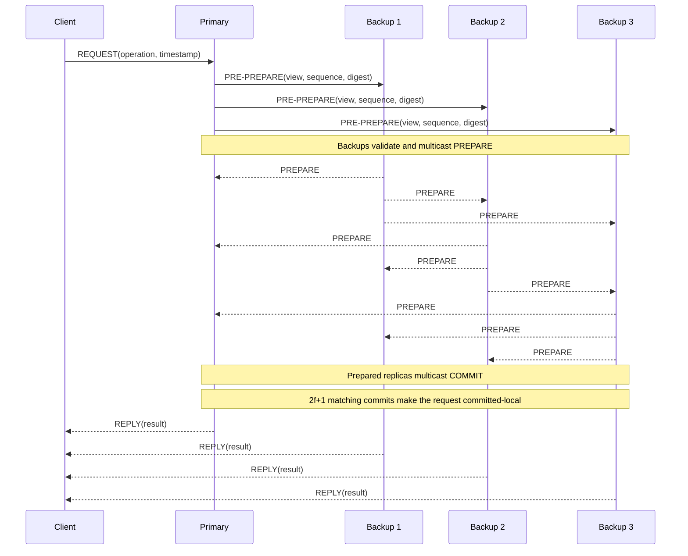

---
tags:
  - distributed-systems
  - consensus
  - fault-tolerance
  - kubernetes
aliases:
  - Consensus
  - PBFT
  - Byzantine Fault Tolerance
title: Consensus
description: Failure models, quorum arithmetic, Raft, PBFT, and etcd operations.
---

# consensus

Consensus lets independent nodes agree on one ordered history despite failures,
delays, and duplicated messages. A replicated state machine applies that history
to identical initial state, so every correct replica produces the same result.

The algorithm is only meaningful together with its **failure model**. Raft and
PBFT solve related problems under different assumptions; PBFT is not a
more-secure drop-in replacement for Raft.

## Failure models

| Failure | What a faulty node can do | Typical model |
| ------- | ------------------------- | ------------- |
| Crash-stop | Halt and never return | Simplified CFT |
| Crash-recovery | Restart with persisted but possibly stale state | Raft, etcd |
| Omission | Lose, delay, or duplicate messages | Networks and partitions |
| Byzantine | Lie, equivocate, corrupt state, or collude | PBFT and other BFT protocols |

A TLS-authenticated peer can still be Byzantine if its host, key, or process is
compromised. Authentication identifies the liar; it does not make a
crash-fault-tolerant protocol tolerate lies.

Consensus normally separates two goals:

- **Safety:** correct nodes never commit conflicting histories.
- **Liveness:** new operations eventually commit.

Protocols preserve safety during a partition by refusing to commit on a side
without quorum. Liveness then depends on enough correct nodes being able to
communicate. In a fully asynchronous system, timeouts cannot distinguish a
failed peer from a slow one; practical protocols rely on eventual periods of
timely communication.

## Quorum arithmetic

### Crash fault tolerance

Raft uses majority quorums:

$$
q = \left\lfloor \frac{n}{2} \right\rfloor + 1
$$

To tolerate (f) unavailable members, the cluster needs at least:

$$
n = 2f + 1
$$

Any two majorities overlap. Raft combines that overlap with voting and log
matching rules so two leaders cannot commit different entries for the same log
position.

### Byzantine fault tolerance

PBFT requires:

$$
n \ge 3f + 1, \qquad q = 2f + 1
$$

Two PBFT quorums overlap in at least:

$$
2q - n = f + 1
$$

With at most (f) Byzantine replicas, the overlap therefore contains at least
one correct replica. This prevents two conflicting values from both collecting
a valid commit certificate.

| Faults tolerated | Raft members | PBFT replicas |
| :--------------: | :----------: | :-----------: |
| 1 | 3 | 4 |
| 2 | 5 | 7 |
| 3 | 7 | 10 |

> [!warning] Replication is not backup
> Consensus reproduces valid operations on every replica. It will faithfully
> replicate an accidental deletion or application-level corruption too.

## Raft vs PBFT

| Property | Raft | PBFT |
| -------- | ---- | ---- |
| Fault model | Crash, restart, delay, partition | Arbitrary or malicious replica behavior |
| Minimum replicas for (f) faults | (2f+1) | (3f+1) |
| Commit quorum | Majority | (2f+1) |
| Coordinator | Elected leader | Primary in a numbered view |
| Normal message cost | (O(n)) per log entry | (O(n^2)) all-to-all phases |
| Replica identity | Stable membership | Authenticated messages and known replicas |
| Common context | etcd, Consul, distributed databases | Multi-party or adversarial replication |

Raft manages an ordered log through leader election, log replication, and
majority commit. It assumes a member may disappear or return with stale state,
but will not fabricate two different messages for two peers.

PBFT replicates a deterministic service while allowing up to (f) replicas to
behave arbitrarily. Its extra replica and message phases are the price of
detecting equivocation rather than merely waiting for a missing node.

## PBFT normal case

For (f=1), PBFT runs four replicas: one primary and three backups. The request
passes through three agreement phases before execution:



1. **Request:** the client signs or authenticates an operation and sends it to
   the primary.
2. **Pre-prepare:** the primary assigns the request a view and sequence number,
   then broadcasts its digest.
3. **Prepare:** backups validate the proposal and multicast matching prepare
   messages. This proves enough replicas saw the same ordering proposal.
4. **Commit:** every prepared replica multicasts a commit. A replica executes
   only after collecting (2f+1) matching commits.
5. **Reply:** replicas execute requests in sequence order. The client accepts
   the result after receiving (f+1) matching replies, which guarantees at
   least one came from a correct replica.

PBFT also uses checkpoints to discard old protocol state and a **view change**
to replace a faulty or unresponsive primary. Safety does not depend on message
timing; progress requires the network eventually to remain timely long enough
for correct replicas to complete a view.

## etcd and Kubernetes

Kubernetes stores its control-plane state in etcd. etcd uses Raft, so it
tolerates unavailable members, slow links, restarts, and network partitions as
long as a majority can communicate. It does **not** tolerate an authenticated
member inventing or equivocating about log entries.

| etcd members | Majority | Failures tolerated |
| :----------: | :------: | :----------------: |
| 1 | 1 | 0 |
| 2 | 2 | 0 |
| 3 | 2 | 1 |
| 4 | 3 | 1 |
| 5 | 3 | 2 |
| 7 | 4 | 3 |

An even member adds replication traffic without increasing failure tolerance.
Use an odd-sized cluster unless a temporary membership change requires
otherwise.

### Inspect an etcd cluster

For a kubeadm-managed local etcd:

```bash
export ETCDCTL_API=3
export ETCDCTL_ENDPOINTS=https://127.0.0.1:2379
export ETCDCTL_CACERT=/etc/kubernetes/pki/etcd/ca.crt
export ETCDCTL_CERT=/etc/kubernetes/pki/etcd/healthcheck-client.crt
export ETCDCTL_KEY=/etc/kubernetes/pki/etcd/healthcheck-client.key

# Member identity and peer/client URLs
etcdctl member list --write-out=table

# Leader, term, Raft index, applied index, and endpoint errors
etcdctl endpoint status --cluster --write-out=table

# End-to-end proposal test, not just process liveness
etcdctl endpoint health --cluster

# Compare the key-value history hash at one revision
etcdctl endpoint hashkv --cluster --write-out=table
```

`endpoint health` attempts to commit a proposal. A process can therefore be
alive while the endpoint is unhealthy because the cluster has no quorum or the
write path is too slow.

### Incident checklist

1. Count configured members and calculate the required majority.
2. Find the leader and compare `RAFT TERM`, `RAFT INDEX`, and
   `RAFT APPLIED INDEX` across endpoints.
3. Check peer connectivity and latency before assuming a member has crashed.
4. Check disk latency: slow `fsync` can delay heartbeats and trigger elections.
5. Do not remove another voting member while the cluster is already degraded.
   Membership changes themselves require consensus.
6. Keep tested snapshots. If quorum is permanently lost, follow the documented
   disaster-recovery procedure instead of forcing a stale member to become the
   new source of truth.

## Choosing a model

Use Raft or another crash-fault-tolerant protocol when one operator controls the
replicas and the realistic failures are process crashes, disk loss, delay, and
partition.

Consider BFT when compromised replicas are explicitly inside the threat model,
replicas belong to mutually distrustful parties, and the extra nodes, message
traffic, deterministic execution, key management, and recovery complexity are
justified.

PBFT is not synonymous with blockchain. Some blockchains use descendants of
BFT protocols; others use different consensus and membership mechanisms.

## References

- [In Search of an Understandable Consensus Algorithm](https://raft.github.io/raft.pdf)
- [Practical Byzantine Fault Tolerance](https://www.usenix.org/legacy/publications/library/proceedings/osdi99/full_papers/castro/castro_html/castro.html)
- [etcd glossary](https://etcd.io/docs/v3.7/learning/glossary/)
- [How to check etcd cluster status](https://etcd.io/docs/v3.6/tasks/operator/how-to-check-cluster-status/)
- [Creating Highly Available Clusters with kubeadm](https://kubernetes.io/docs/setup/production-environment/tools/kubeadm/high-availability/)
