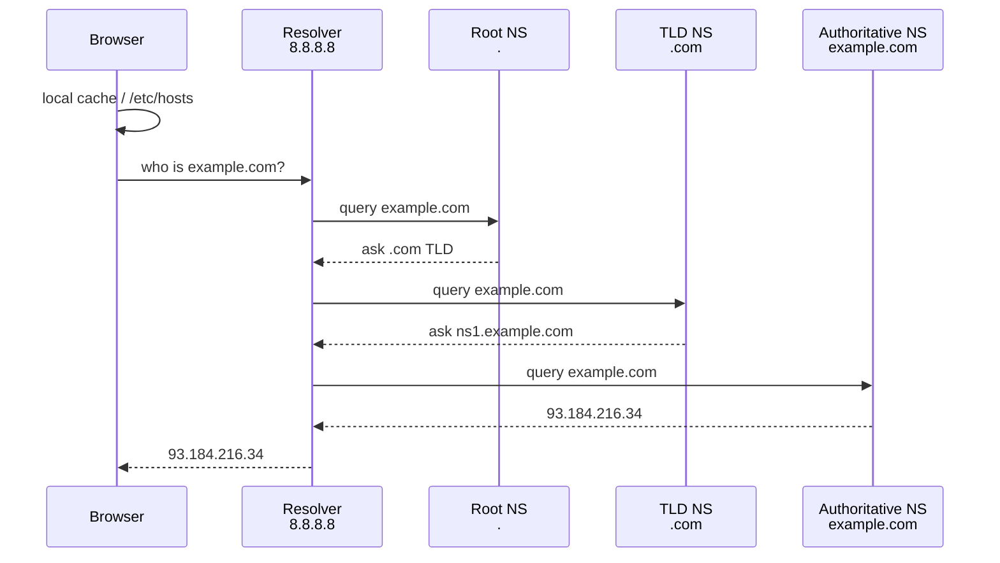

---
tags:
  - networking
  - dns
aliases:
  - DNS
title: DNS
---

# dns

Domain Name System — translates human-readable names to IP addresses.
The phone book of the internet.

## How resolution works



## Record types

| Type | Purpose | Example |
|------|---------|---------|
| A | Name → IPv4 | `example.com → 93.184.216.34` |
| AAAA | Name → IPv6 | `example.com → 2606:2800:220:1:...` |
| CNAME | Alias → another name | `www.example.com → example.com` |
| MX | Mail server | `example.com → mail.example.com (pri 10)` |
| TXT | Arbitrary text | SPF, DKIM, domain verification |
| NS | Name server | `example.com → ns1.example.com` |
| SOA | Zone authority | Serial, refresh, retry, expire |
| SRV | Service location | `_http._tcp.example.com → ...` |
| PTR | Reverse lookup (IP → name) | `34.216.184.93 → example.com` |

## Diagnostic commands

```bash
# Basic lookup
dig example.com
dig example.com +short

# Specific record type
dig MX example.com
dig TXT example.com
dig AAAA example.com

# Query specific nameserver
dig @8.8.8.8 example.com

# Trace full resolution path
dig +trace example.com

# Reverse lookup
dig -x 93.184.216.34

# Short answer with nslookup
nslookup example.com
host example.com
```

## Local resolution

```bash
# Check local resolver config
cat /etc/resolv.conf

# Check hosts file
cat /etc/hosts

# Check nsswitch order
grep hosts /etc/nsswitch.conf
```

## Common issues

**Resolution fails locally but works from outside:**
- Check `/etc/resolv.conf` — wrong nameserver?
- Check `/etc/nsswitch.conf` — is `files` before `dns`?
- CoreDNS/kube-dns issues in Kubernetes

**TTL too high after DNS change:**
```bash
# Check current TTL
dig example.com | grep -E '^\w'
# Lower TTL before migration, wait for old TTL to expire
```

## See also

- [[net_info]]
