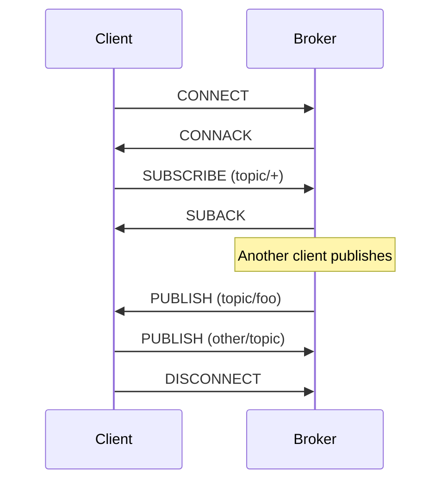

---
tags:
  - networking
  - protocols
  - iot
aliases:
  - MQTT
title: MQTT
description: MQTT protocol — lightweight pub/sub messaging for IoT with broker architecture, QoS levels, and security.
---

# mqtt

MQTT (Message Queuing Telemetry Transport) is a lightweight publish-subscribe messaging protocol. Designed in 1999 for oil pipeline monitoring over satellite links, it optimizes for unreliable networks, limited bandwidth, and constrained devices.

The protocol follows a client-broker architecture. Clients never communicate directly — they publish messages to a broker, which routes them to interested subscribers. This decoupling means publishers don't need to know who (if anyone) receives their messages, and subscribers don't need to know where messages originate.

MQTT runs over TCP/IP (port 1883) or TLS (port 8883). The binary protocol has minimal overhead — a fixed header of just 2 bytes. Compare this to HTTP's text headers that often exceed the payload size for small messages.

## Core concepts

**Topics** are hierarchical strings that route messages. They use forward slashes as separators: `home/livingroom/temperature`, `factory/line1/machine3/status`. Topics aren't pre-declared — they exist when someone publishes or subscribes.

**Wildcards** allow subscribing to multiple topics. Single-level `+` matches one level: `home/+/temperature` matches `home/bedroom/temperature` and `home/kitchen/temperature`. Multi-level `#` matches everything below: `home/#` catches all messages starting with `home/`.

**Quality of Service (QoS)** defines delivery guarantees:

| QoS | Name | Guarantee | Use case |
|-----|------|-----------|----------|
| 0 | At most once | Fire and forget, may lose messages | Sensor readings where loss is acceptable |
| 1 | At least once | Guaranteed delivery, may duplicate | Commands that must arrive |
| 2 | Exactly once | No loss, no duplicates | Financial transactions, critical state |

QoS 0 has lowest overhead. QoS 2 requires four-packet handshake. Choose based on your reliability requirements.

**Retained messages** persist on the broker. When you publish with the retain flag, the broker stores the last message for that topic. New subscribers immediately receive the retained message without waiting for the next publish. Useful for status topics — a new client instantly knows the current state.

**Last Will and Testament (LWT)** handles ungraceful disconnects. When connecting, a client can register a "last will" message. If the client disconnects without sending DISCONNECT (network failure, crash), the broker publishes the LWT to notify others. Common pattern: publish `online` to `device/status` on connect, set LWT to publish `offline` on the same topic.

## Message flow



## MQTT vs HTTP

| Aspect | MQTT | HTTP |
|--------|------|------|
| Pattern | Pub/Sub | Request/Response |
| Connection | Persistent | Per-request |
| Header overhead | 2 bytes minimum | Hundreds of bytes |
| Direction | Bidirectional | Client-initiated |
| Power consumption | Low (long-lived connection) | High (repeated handshakes) |
| Real-time | Native (push) | Polling or WebSocket |

For IoT devices that send frequent small messages, MQTT dramatically reduces bandwidth and battery usage.

## Installing Mosquitto

On Debian/Ubuntu:

```bash
apt install mosquitto mosquitto-clients
systemctl enable --now mosquitto
```

On Fedora:

```bash
dnf install mosquitto
systemctl enable --now mosquitto
```

Default configuration listens on localhost:1883. Edit `/etc/mosquitto/mosquitto.conf` for network access:

```text
listener 1883
allow_anonymous true
```

For production, configure authentication and TLS.

## Publishing and subscribing

Open two terminals. In the first, subscribe:

```bash
mosquitto_sub -h localhost -t "test/topic"
```

In the second, publish:

```bash
mosquitto_pub -h localhost -t "test/topic" -m "Hello MQTT"
```

With QoS and retained messages:

```bash
# Publish retained message with QoS 1
mosquitto_pub -h localhost -t "device/status" -m "online" -q 1 -r

# New subscriber gets retained message immediately
mosquitto_sub -h localhost -t "device/status" -v
```

## Python example

```bash
pip install paho-mqtt
```

Publisher:

```python
import paho.mqtt.client as mqtt

client = mqtt.Client()
client.connect("localhost", 1883, 60)

client.publish("sensors/temperature", "23.5", qos=1)
client.disconnect()
```

Subscriber:

```python
import paho.mqtt.client as mqtt

def on_message(client, userdata, msg):
    print(f"{msg.topic}: {msg.payload.decode()}")

client = mqtt.Client()
client.on_message = on_message
client.connect("localhost", 1883, 60)
client.subscribe("sensors/#")
client.loop_forever()
```

## Kubernetes integration

Deploy Mosquitto in Kubernetes:

```yaml
apiVersion: apps/v1
kind: Deployment
metadata:
  name: mosquitto
spec:
  replicas: 1
  selector:
    matchLabels:
      app: mosquitto
  template:
    metadata:
      labels:
        app: mosquitto
    spec:
      containers:
        - name: mosquitto
          image: eclipse-mosquitto:2
          ports:
            - containerPort: 1883
            - containerPort: 9001
          volumeMounts:
            - name: config
              mountPath: /mosquitto/config
      volumes:
        - name: config
          configMap:
            name: mosquitto-config
---
apiVersion: v1
kind: Service
metadata:
  name: mosquitto
spec:
  selector:
    app: mosquitto
  ports:
    - name: mqtt
      port: 1883
    - name: websocket
      port: 9001
```

For production, use EMQX or HiveMQ operators that handle clustering and persistence.

## Security

### Authentication

Mosquitto supports password files:

```bash
# Create password file
mosquitto_passwd -c /etc/mosquitto/passwd username

# Configure broker
echo "password_file /etc/mosquitto/passwd" >> /etc/mosquitto/mosquitto.conf
echo "allow_anonymous false" >> /etc/mosquitto/mosquitto.conf
```

Connect with credentials:

```bash
mosquitto_sub -h localhost -t "test/#" -u username -P password
```

### TLS encryption

Configure the broker:

```text
listener 8883
cafile /etc/mosquitto/certs/ca.crt
certfile /etc/mosquitto/certs/server.crt
keyfile /etc/mosquitto/certs/server.key
require_certificate false
```

Connect with TLS:

```bash
mosquitto_sub -h localhost -p 8883 --cafile ca.crt -t "test/#"
```

### Access control lists

Restrict topic access per user:

```text
# /etc/mosquitto/acl
user sensor1
topic read sensors/sensor1/#
topic write sensors/sensor1/data

user admin
topic readwrite #
```

## MQTT 5.0

Version 5.0 (2019) added significant improvements:

- **Shared Subscriptions** — load-balance messages across multiple subscribers
- **Message Expiry** — messages auto-delete after TTL
- **Topic Aliases** — reduce bandwidth by replacing topics with integers
- **Request/Response** — correlation data and response topics for RPC patterns
- **User Properties** — custom key-value metadata on messages
- **Reason Codes** — detailed error information in all acknowledgments

Most modern brokers support 5.0 while maintaining 3.1.1 compatibility.

## Use cases

### IoT sensors

Thousands of sensors publishing readings:

```text
sensors/building1/floor2/room201/temperature
sensors/building1/floor2/room201/humidity
sensors/building1/floor2/room201/occupancy
```

Central system subscribes to `sensors/#` for aggregation.

### Device commands

Bidirectional communication:

```text
devices/thermostat1/status    -> device publishes state
devices/thermostat1/command   -> server publishes commands
```

Device subscribes to its command topic, publishes to status.

## See also

- [[dns]]
- [[http]]
- [[tls]]

## References

- [MQTT 5.0 Specification](https://docs.oasis-open.org/mqtt/mqtt/v5.0/mqtt-v5.0.html)
- [MQTT 3.1.1 Specification](https://docs.oasis-open.org/mqtt/mqtt/v3.1.1/mqtt-v3.1.1.html)
- [HiveMQ MQTT Essentials](https://www.hivemq.com/mqtt-essentials/)
- [Mosquitto](https://mosquitto.org/)
- [Paho MQTT Client](https://eclipse.dev/paho/)
- [MQTT Explorer](http://mqtt-explorer.com/)
