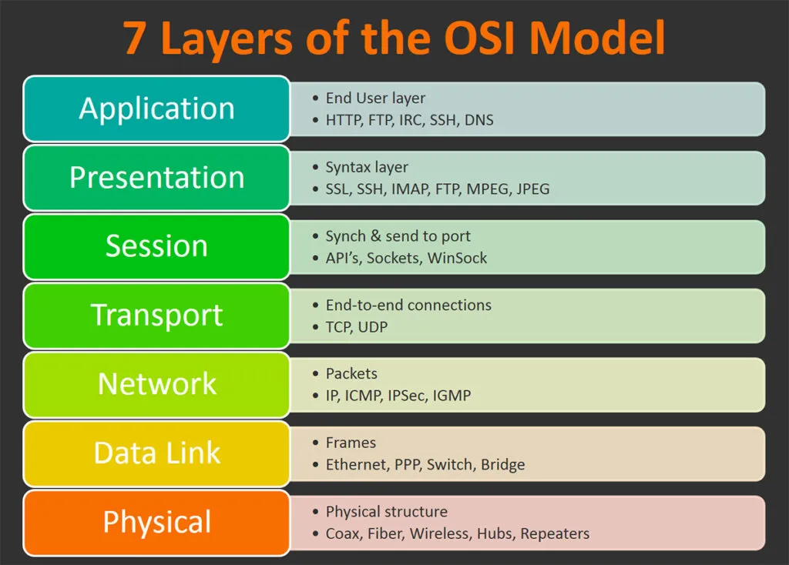

---
tags:
  - networking
  - models
aliases:
  - OSI Model
title: OSI Model
description: Seven layers of the OSI model with troubleshooting guide.
---

# osi_model

Open Systems Interconnection — a reference model for how protocols
communicate over a network. Seven layers, bottom to top.



## Layers

| # | Layer | Function | Protocols / Examples |
|---|-------|----------|---------------------|
| 7 | Application | User-facing services | HTTP, FTP, SMTP, DNS |
| 6 | Presentation | Data format, encryption | TLS/SSL, JPEG, ASCII |
| 5 | Session | Connection management | NetBIOS, RPC |
| 4 | Transport | Reliable delivery | TCP, UDP |
| 3 | Network | Routing, addressing | IP, ICMP, ARP |
| 2 | Data Link | Frames, MAC addressing | Ethernet, Wi-Fi, PPP |
| 1 | Physical | Bits on wire | Cables, hubs, signals |

## How to remember

**Layer 1 → 7:** Please Do Not Throw Sausage Pizza Away

**Layer 7 → 1:** All People Seem To Need Data Processing

## Troubleshooting by layer

When diagnosing an issue, work from **bottom to top**:
Note: in practice, Presentation (6) and Session (5) are often folded into Application-level checks.

1. **Physical** — is the cable plugged in? Is the link up?
   ```bash
   ip link
   ethtool eth0
   ```
2. **Data Link** — do we have a MAC address? ARP working?
   ```bash
   ip neigh
   arp -a
   ```
3. **Network** — do we have an IP? Can we reach the gateway?
   ```bash
   ip addr
   ping -c 3 $gateway
   traceroute $destination
   ```
4. **Transport** — is the port open? Is something listening?
   ```bash
   ss -tulpn | grep $port
   nc -zv $host $port
   ```
5. **Application** — does the service respond correctly?
   ```bash
   curl -v https://$host
   dig $domain
   ```

## See also

- [tcp_ip_model](tcp_ip_model.md)

## References

- [Understanding the OSI Model](https://int0x33.medium.com/day-51-understanding-the-osi-model-f22d5f3df756)
