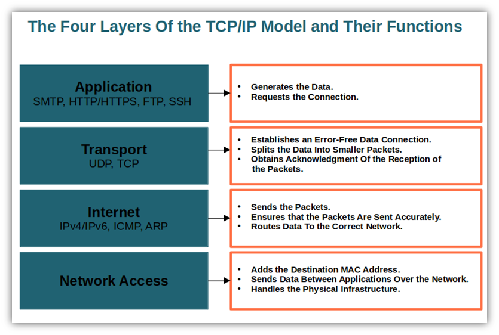
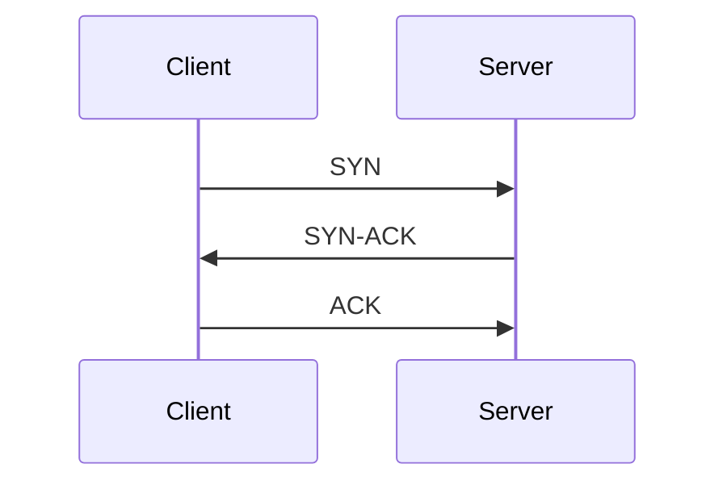
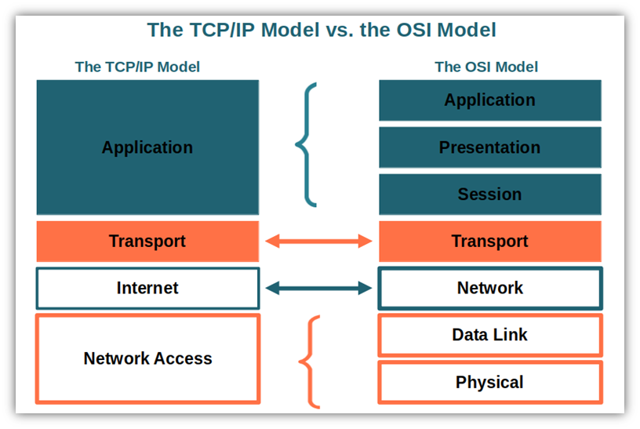

---
tags:
  - networking
  - models
aliases:
  - TCP/IP Model
title: TCP/IP Model
description: Four-layer TCP/IP model with protocol mapping and port reference.
---

# tcp_ip_model

The practical model. Four layers instead of seven.
This is what the internet actually runs on.

## Layers

| # | TCP/IP Layer | OSI Equivalent | Protocols |
|---|-------------|----------------|-----------|
| 4 | Application | 5, 6, 7 | HTTP, DNS, SMTP, SSH, FTP |
| 3 | Transport | 4 | TCP, UDP |
| 2 | Internet | 3 | IP, ICMP, ARP |
| 1 | Network Access | 1, 2 | Ethernet, Wi-Fi |

## TCP vs UDP

| | TCP | UDP |
|---|-----|-----|
| Connection | Connection-oriented (3-way handshake) | Connectionless |
| Reliability | Guaranteed delivery, ordering | Best effort, no guarantees |
| Speed | Slower (overhead) | Faster (no overhead) |
| Use cases | HTTP, SSH, FTP, SMTP | DNS, DHCP, streaming, gaming |

## TCP three-way handshake

## Key port numbers

| Port | Service | Protocol |
|------|---------|----------|
| 22 | SSH | TCP |
| 53 | DNS | TCP/UDP |
| 80 | HTTP | TCP |
| 443 | HTTPS | TCP |
| 25 | SMTP | TCP |
| 110 | POP3 | TCP |
| 143 | IMAP | TCP |
| 3306 | MySQL | TCP |
| 5432 | PostgreSQL | TCP |
| 6443 | Kubernetes API | TCP |

## TCP/IP vs OSI

## See also

- [[osi_model]]

## References

- [What Is the TCP Model? An Exploration of TCP/IP Layers](https://cheapsslsecurity.com/blog/what-is-the-tcp-model-an-exploration-of-tcp-ip-layers/)
- [Transport Layer Protocols and Known Security Issues](https://int0x33.medium.com/day-55-transport-layer-protocols-and-known-security-issues-136109fa31d3)
