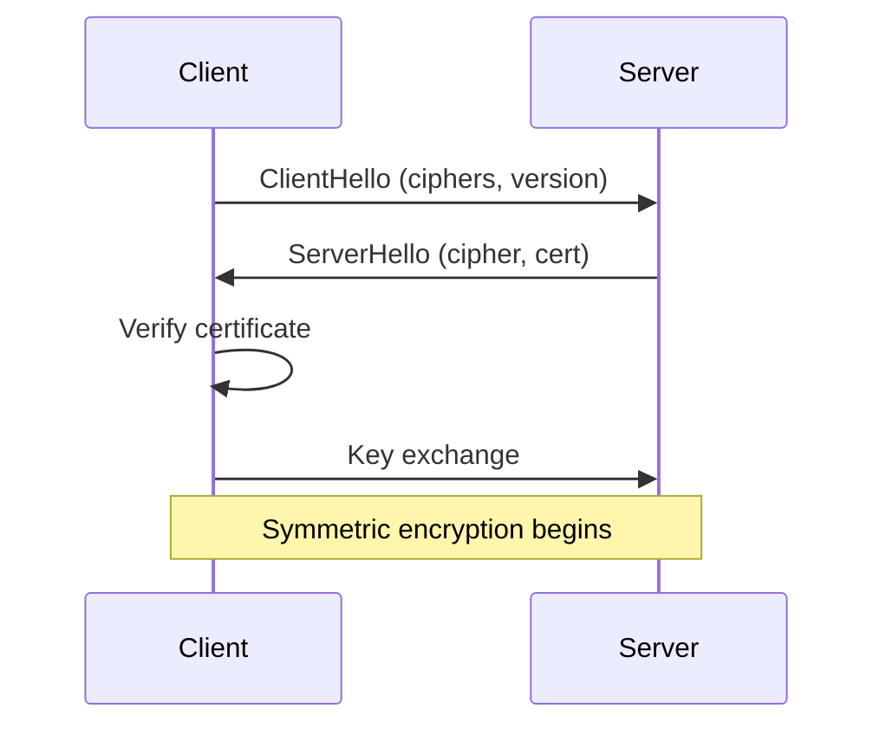

---
tags:
  - networking
  - security
  - tls
aliases:
  - TLS
  - SSL
title: TLS
description: TLS handshake, certificates, and debugging commands.
---

# tls

Transport Layer Security — encrypts data in transit.
Successor to SSL. When people say "SSL" they almost always mean TLS.

## SSL vs TLS

SSL (Secure Sockets Layer) was the original protocol. Deprecated due to
vulnerabilities. TLS (Transport Layer Security) is the modern replacement.

| Version | Status |
|---------|--------|
| SSL 2.0, 3.0 | Deprecated, insecure |
| TLS 1.0, 1.1 | Deprecated since 2020 |
| TLS 1.2 | Widely used, still secure |
| TLS 1.3 | Current, fastest, most secure |

## TLS handshake (simplified)



TLS 1.3 reduced the handshake from 2 round-trips to 1.

## Certificate inspection

```bash
# Check remote certificate
openssl s_client -connect example.com:443 </dev/null 2>/dev/null \
  | openssl x509 -noout -text

# Expiry date only
openssl s_client -connect example.com:443 </dev/null 2>/dev/null \
  | openssl x509 -noout -dates

# Check with curl
curl -vI https://example.com 2>&1 | grep -E 'expire|subject|issuer'
```

## Self-signed certificate (dev/testing)

```bash
openssl req -x509 -nodes -days 365 -newkey rsa:2048 \
  -keyout tls.key -out tls.crt \
  -subj "/CN=localhost"
```

## Kubernetes TLS secret

```bash
kubectl create secret tls my-tls-secret \
  --cert=tls.crt --key=tls.key -n $ns
```

## Common issues

**Certificate expired:**
- Check with `openssl s_client` above
- In Kubernetes: check cert-manager logs, Certificate and CertificateRequest resources

**ERR_CERT_AUTHORITY_INVALID:**
- Self-signed cert or missing intermediate CA in chain
- Chain must include: leaf cert → intermediate(s) → root CA

**TLS version mismatch:**
```bash
# Test specific TLS version
openssl s_client -connect example.com:443 -tls1_2
openssl s_client -connect example.com:443 -tls1_3
```
