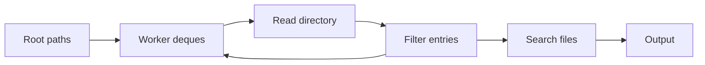

# Parallel Search Traversal

Recursive code search is not one long matcher invocation. It discovers paths,
applies ignore rules, opens eligible files, scans their contents, and combines
results. Ripgrep distributes this irregular work among threads using a
work-stealing directory traversal.



The traversal algorithm often matters more than the string matcher when a tree
contains thousands of small files.

## Why a Shared FIFO Is Not Enough

A single synchronized queue can distribute work, but every worker contends for
the same lock or atomic data structure. Directory trees are also unbalanced:
one root child may contain one file while another contains an entire dependency
tree.

Static partitioning by top-level directory therefore creates idle workers:

```text
worker 1: src/          ####################
worker 2: tests/        ####
worker 3: docs/         ##
worker 4: empty/        #
```

The amount of work below a directory is not known until it is opened. Dynamic
scheduling is a better fit.

## Work Stealing

Each worker owns a double-ended queue of pending paths:

1. it pushes newly discovered work onto its local deque;
2. it pops local work without contending with other workers;
3. when empty, it steals work from another worker's deque;
4. termination occurs only when no worker has local or stealable work.

```text
worker A deque: [large subtree, dir, file, file] <- local pop
                 ^ steal batch
worker B deque: []
```

The `ignore` crate used by ripgrep employs work-stealing stacks and can steal a
batch rather than one item. Batch stealing amortizes synchronization and gives
an idle worker enough work to remain productive.

Local stack behavior tends toward depth-first traversal. It keeps the active
frontier smaller than a global breadth-first queue and preserves locality among
paths from the same directory. Stealing older work exposes larger independent
subtrees to other workers.

## Work Item Granularity

Work can be divided at several levels:

| Granularity | Advantage | Cost |
| ----------- | --------- | ---- |
| Root directory | Almost no scheduling overhead | Poor balance for uneven roots |
| Subdirectory | Good balance and natural ownership | Directory metadata overhead |
| File | Effective for many independent files | Queue traffic for tiny files |
| File chunk | Parallelizes one huge file | Harder boundaries and ordered output |

Ripgrep primarily parallelizes independent paths. Searching one file normally
does not become faster merely because the thread count is high; a single large
file has different I/O and matcher constraints from a large repository.

## Ignore Rules Are Part of Traversal

An entry must be filtered before it becomes useful search work. Ripgrep can
combine:

- `.gitignore`, repository excludes, and global Git excludes;
- `.ignore` and `.rgignore` files with their precedence rules;
- hidden-file and binary-file policy;
- file type, glob, depth, and size filters;
- symbolic-link policy.

Ignore rules are scoped. Descending into a directory may add another ignore
file, and the resulting matcher applies to that subtree. A worker therefore
needs both the path and the correct inherited ignore context.

Multiple glob rules can be compiled into a set matcher so a path is tested
against the group in one operation. Pruning an ignored directory early avoids
all metadata calls and file scans below it, which is much more valuable than
rejecting each descendant later.

```text
target/ ignored
  -> do not enumerate target/debug/...
  -> do not open its files
  -> do not run the content matcher
```

## Ordering vs Parallelism

Concurrent workers discover and finish files in nondeterministic order. Strict
path ordering requires buffering results, coordinating workers, or reducing
parallelism. That can increase latency and memory use even though matching work
is unchanged.

This distinction matters in benchmarks: two commands that print the same
matching lines may perform different scheduling and ordering work.

## Scaling Limits

Adding threads helps only while independent work and another bottleneck remain
available.

| Bottleneck | Why more threads stop helping |
| ---------- | ----------------------------- |
| Storage bandwidth | Workers compete for the same device |
| Metadata latency | Filesystem or remote mount serializes operations |
| Page cache | Memory bandwidth becomes saturated |
| Few large files | Too few independent path tasks |
| Tiny files | Scheduling and `open` calls dominate matching |
| Dense matches | Output coordination dominates scanning |
| Ignore matching | Complex rules consume traversal CPU |

Oversubscription can reduce performance through context switches, cache
pressure, and less sequential I/O. The best thread count is workload-specific.

## Observing the Pipeline

Useful controlled comparisons include:

```bash
# Compare one worker with the default parallel traversal
time rg --threads 1 --no-config -F -- 'needle' src/ >/dev/null
time rg --no-config -F -- 'needle' src/ >/dev/null

# Search the same corpus with and without automatic filtering
time rg --no-config -F -- 'needle' . >/dev/null
time rg --no-config -uuu -F -- 'needle' . >/dev/null

# Explain why individual paths are filtered
rg --debug -- 'needle' .
```

The second pair intentionally searches different corpora. It measures the
effect of filtering, not just the overhead of evaluating ignore rules.

For deeper investigation, count filesystem calls and CPU events:

```bash
strace -c rg --no-config -F -- 'needle' . >/dev/null
perf stat rg --no-config -F -- 'needle' . >/dev/null
```

Record filesystem type, cache state, corpus shape, thread count, tool version,
and output mode. A warm local source tree and a cold network mount are different
experiments.

## grep vs ripgrep

GNU grep supports recursive search, but its defining portable role is the
line-oriented matcher used in files and pipelines. Ripgrep is designed around
repository traversal, parallelism, and ignore-aware filtering.

This is why comparing only Boyer-Moore, Aho-Corasick, or regex automata cannot
predict which command finishes first on a directory. The tools may search
different files and spend most of their time outside the matcher.

## See Also

- [Search](search.md) — section index
- [grep and ripgrep Internals](grep_and_ripgrep.md) — complete pipeline
- [Literal Prefilters](literal_prefilters.md) — candidate search inside files
- [Regex Automata](regex_automata.md) — regex verification engines
- [grep and ripgrep recipes](hacks/bash/grep.md) — traversal flags in practice

## References

- [ripgrep](https://github.com/BurntSushi/ripgrep)
- [ripgrep User Guide: automatic filtering](https://github.com/BurntSushi/ripgrep/blob/master/GUIDE.md#automatic-filtering)
- [ignore crate](https://docs.rs/ignore/latest/ignore/)
- [ignore parallel walker source](https://docs.rs/ignore/latest/src/ignore/walk.rs.html)
- [ripgrep performance analysis](https://github.com/BurntSushi/blog/blob/master/content/post/ripgrep.md)
