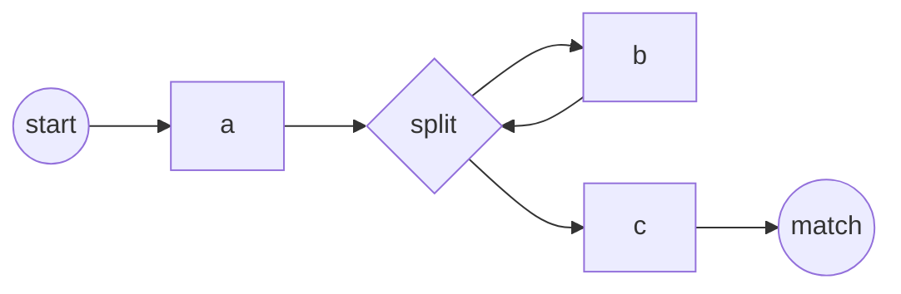

# Regex Automata

A regular expression describes a language rather than one literal string. A
search tool can compile the expression into a finite automaton and feed the
input through that machine instead of trying every possible match path
recursively.

```text
pattern -> parse -> syntax tree -> NFA -> execution strategy
                                      |-> DFA
                                      |-> lazy DFA
                                      `-> NFA simulation
```

This model explains both the predictable behavior of the default ripgrep
engine and why `rg -P` crosses into a different performance model.

## Thompson NFA

Thompson's construction builds a nondeterministic finite automaton from small
fragments. The important state types are:

| State | Meaning |
| ----- | ------- |
| Byte or character | Consume one matching input unit |
| Split | Follow either branch without consuming input |
| Match | Accept the expression |

The construction composes fragments mechanically:

- concatenation connects the first fragment to the second;
- alternation adds a split whose branches enter both alternatives;
- `*` adds a split that either enters the fragment or skips it, then loops;
- `?` adds a split that either enters or skips the fragment.

For `ab*c`, the machine has this shape:



The split represents both possible choices at once. An NFA simulator keeps a
**set of active states**, expands every split through an epsilon closure, then
advances all matching states for the next byte.

```python
current = epsilon_closure(start)
for byte in text:
    following = set()
    for state in current:
        if state.consumes(byte):
            following.add(state.next)
    current = epsilon_closure(following)
```

For an expression with \(m\) states and input of length \(n\), this direct
simulation takes \(O(mn)\) time and \(O(m)\) active-state memory. Most
importantly, it does not revisit the same state at the same input position for
every alternative path.

## From NFA to DFA

A deterministic finite automaton stores each possible **set of NFA states** as
one DFA state. Search then maintains only one current DFA state and performs
one transition per input unit.

| Property | NFA simulation | Full DFA |
| -------- | -------------- | -------- |
| Runtime state | Set of NFA states | One DFA state |
| Search cost | \(O(mn)\) | \(O(n)\) after construction |
| Captures | Can track them | Usually omitted from the search DFA |
| Construction | Linear in regex size | Can create exponentially many states |
| Memory | Proportional to NFA | Potentially large |

The exponential DFA size is a worst case, not a requirement for every regex.
Many practical expressions produce compact machines.

### Lazy DFA

A lazy or hybrid DFA constructs states only when the input reaches them and
caches the resulting transitions. It often approaches DFA scan speed while
placing a bound on memory. Cache eviction can cause states to be rebuilt, so it
trades predictable memory for input-dependent construction work.

## Captures and Other Execution Engines

Finding whether and where a regex matches is easier than returning every
capturing group. Production libraries therefore combine several engines:

| Engine | Strength | Main tradeoff |
| ------ | -------- | ------------- |
| Full DFA | Fast repeated transitions | Construction time and memory |
| Lazy DFA | Fast path with bounded cache | Cache churn on difficult inputs |
| One-pass DFA | Fast captures for suitable regexes | Only a subset is one-pass |
| PikeVM | General Thompson-style NFA with captures | More per-byte bookkeeping |
| Bounded backtracker | Captures on small inputs | Memory proportional to regex and input |

The Rust `regex-automata` library exposes these strategies and a meta engine
that chooses and composes them. Consequently, “ripgrep uses a DFA” is a useful
first approximation, not a complete description of every query.

## Why Backtracking Is Different

A traditional backtracking engine follows one alternative at a time. On
failure, it returns to the most recent choice and tries another path. This
enables features that are outside regular languages, especially
backreferences, and commonly accompanies look-around support.

Ambiguous nested alternatives can make the engine revisit equivalent work an
exponential number of times. Thompson NFA simulation keeps all active paths
together, so regular constructs retain a polynomial bound.

```text
finite automaton: merge equivalent active states
backtracking:     explore paths separately and return to old choices
```

PCRE2 has extensive optimizations and is not slow by definition. The important
difference is that enabling it admits richer syntax and less predictable worst
cases.

## grep and ripgrep Paths

GNU grep uses a DFA-based matcher for basic and extended regular expressions
when feasible. Features such as backreferences require a slower verification
path. POSIX defines the command's results, not which internal engine produces
them.

Ripgrep's default Rust regex stack stays within regular-language features and
can combine literal prefilters with automata:

```bash
# The required literal "error: " can cheaply find candidates
rg 'error: [0-9]+' logs/

# No long required literal; the automaton does more of the scanning
rg '[a-z]{30}' src/

# Look-behind selects the optional PCRE2 engine
rg -P '(?<=service-)[0-9]+' .
```

A [literal prefilter](literal_prefilters.md) does not replace the automaton. It
rejects positions or blocks that cannot match; the regex engine verifies
candidates and reports the correct match boundaries and captures.

## Choosing the Model

| Requirement | Appropriate model |
| ----------- | ----------------- |
| Predictable search over regular syntax | Thompson NFA or DFA family |
| Repeated scans with a stable regex | Amortize DFA construction |
| Captures with regular syntax | PikeVM or suitable one-pass engine |
| Backreferences or look-around | PCRE2-style engine with input controls |
| One or many exact strings | Literal search, not a general regex engine |

At the command line, express intent first: use `-F` for literal data and `-P`
only for syntax the default engine cannot represent. Then benchmark the real
pattern, corpus, and output mode rather than an isolated regex evaluator.

## See Also

- [Search](search.md) — section index
- [Literal Prefilters](literal_prefilters.md) — extracting literals before
  automaton execution
- [Aho-Corasick](aho_corasick.md) — several fixed strings in one pass
- [Two-Way String Matching](two_way.md) — one fixed string with linear bounds
- [Boyer-Moore](boyer_moore.md) — one fixed pattern with skip heuristics
- [grep and ripgrep Internals](grep_and_ripgrep.md) — complete tool pipeline
- [grep and ripgrep recipes](hacks/bash/grep.md) — practical commands

## References

- [Regular Expression Matching Can Be Simple And Fast](https://swtch.com/~rsc/regexp/regexp1.html)
- [regex-automata crate documentation](https://docs.rs/regex-automata/latest/regex_automata/)
- [GNU grep: Performance](https://www.gnu.org/software/grep/manual/html_node/Performance.html)
- [ripgrep FAQ](https://github.com/BurntSushi/ripgrep/blob/master/FAQ.md)
